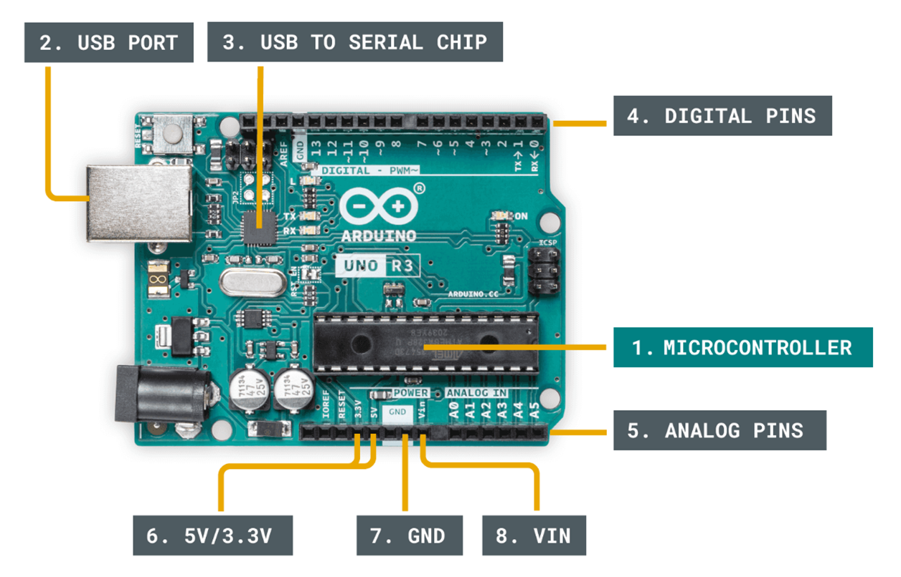
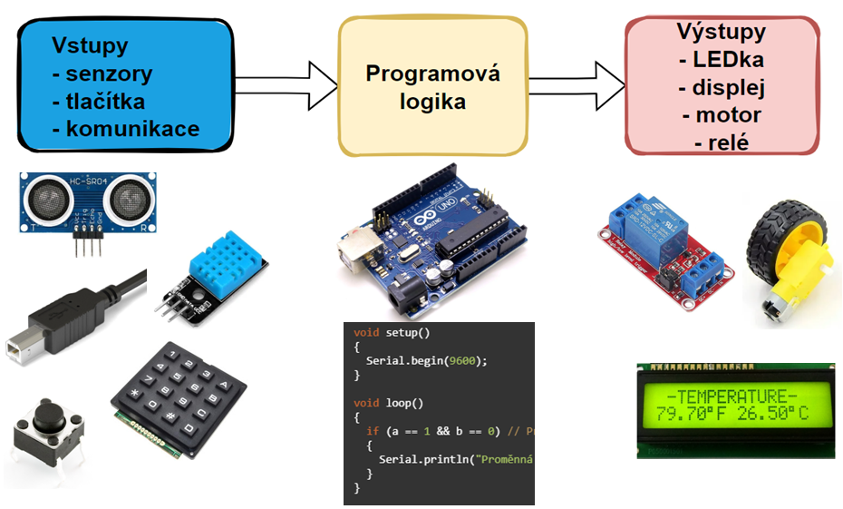
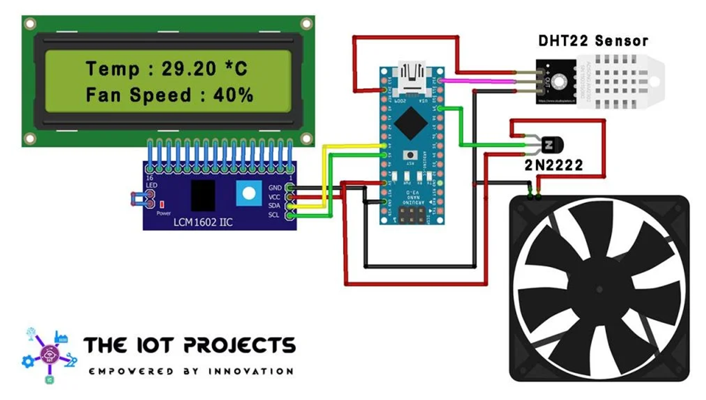
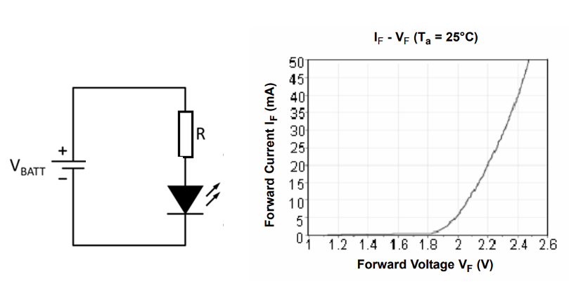
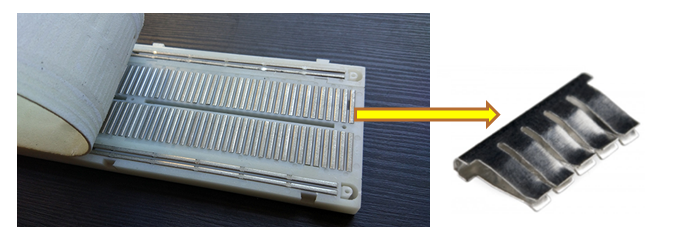
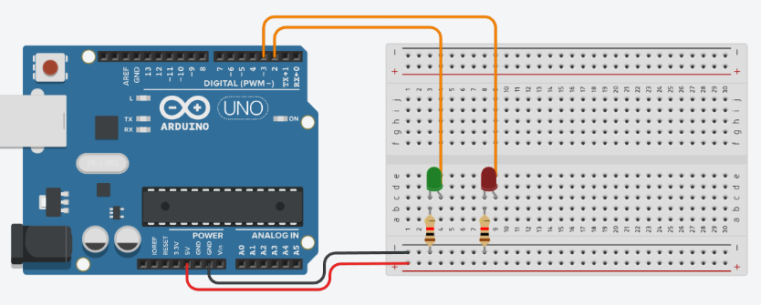
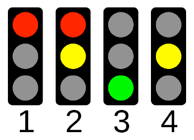

# Úvod do Arduina

### Cíle lekce
- Vysvětlit, co je Arduino a k čemu se používá.
- Otevřít Arduino IDE a ukázat, jak se píše a nahrává program.
- Naučit se základní strukturu programu (setup(), loop()).
- Ovládat Arduinem LEDku pomocí funkce digitalWrite().
- Zopakovat si práci s nepájivým polem (napájení, správné zapojování součástek).


## Co je to Arduino?
Arduino je platforma pro výuku a vývoj elektronických projektů. Z hardwarového pohledu je to deska s procesorem, ke které můžete připojit různé senzory, motory, světla a další komponenty, a poté je ovládat pomocí kódu. Programování probíhá v jednoduchém jazyce a jsou k dispozici spousty hotových knihoven, což Arduino činí ideálním nástrojem pro začátečníky i pokročilé, kteří se chtějí naučit základy elektroniky a programování. Arduino se používá ve spoustě projektů, od domácí automatizace po robotiku.

## Hardware
Existuje mnoho typů Arduino desek s různými mikrokontrolery - liší se výkonem, počtem pinů, možnostmi WiFi, Bluetooth atd. V našich hodinách budeme používat Arduino UNO s procesorem ATmega 328.



## Princip fungování embedded systémů
Slovo „embedded“ znamená, že jde o systémy, které jsou součástí nějakého zařízení, například mikrokontrolér v ledničce, autě nebo robotu, který vykonává specifické úkoly.



## Příklad projektu s Arduinem
Dokážete při pohledu na obrázek popsat, k čemu tento projekt slouží a jaký asi program běží v Arduinu?




## Psaní programu pro Arduino - funkce setup() a loop()
```C
//sem prijde vlozeni knihoven, inicializace proměnných...

void setup() {
    // zde vlozte kod, ktery ma bezet pouze jednou

}

void loop() {
    // zde vlozte kod hlavni kod, ktery se bude opakovat donekonecna

}
```

## Blikání LEDkou na desce Arduina
Přímo na desce Arduina je jedna LED, kteoru můžeme z programu ovládat. Je připojena na pin 13. Co budeme potřebovat?

Nastavit pin, kde je připojena LEDka jako výstup
```c
pinMode(13, OUTPUT);
```

Rozsvítit LEDku, tím, že na pin, kde je připojena nastavíme logickou jedničku (tedy 5V)
```c
digitalWrite(13, HIGH); //zapnutí led
```

Počkat nějakou dobu, abychom lidské oko vidělo, že LEDka svítí
```c
delay(1000); // čekání po dobu jedné sekundy
```

Celý program blikání LEDkou:

```c
//sem prijde vlozeni knihoven, inicializace proměnných...
int led = 13;

void setup() {
    // zde vlozte kod, ktery ma bezet pouze jednou
    pinMode(led, OUTPUT);
}

void loop() {
    // zde vlozte kod hlavni kod, ktery se bude opakovat donekonecna
    digitalWrite(led, HIGH); //zapnutí led
    delay(1000); // čekání po dobu jedné sekundy

    digitalWrite(led, LOW); // vypnuti LED
    delay(1000); // čekání po dobu jedné sekundy
}
```

## Přidání další LEDky, nepájivé pole
Na desce Arduina je jen jedna LEDka, kterou můžeme ovládat (pokud nepočítáme LEDky na pinech Tx a Rx, které ale využíváme k programování Arduina). Zkusíme si teď připojit další LEDku s pomocí nepájivého pole. Nesmíme zapomenout na sŕiový odpor. Jak spočítat jeho velikost?



Nepájivé pole (breadboard) je nástroj, který slouží k rychlému sestavení elektronických obvodů bez nutnosti pájení. Má řadu malých děr, které jsou elektricky propojené, a do těchto děr se zasouvají součástk nebo vodiče. Umožňuje tedy snadno testovat a upravovat obvody.





## Tlačítko
Tlačítko může sloužit jako jednoduché vstupní zařízení pro Arduino. Mechanicky je to vlastně jen pružný kontakt, který při stisku propojí dva vodiče. Způsobů, jak zapojit tlačítko je více, ukážeme si ten nejjednodušší, který nevyžaduje další součástky.

Jeden pól tlačítka zapojíme na digitální vstup Arduina (např. D2). Druhý pól tlačítka zapojíme na GND. V programu nastavíme vstup takto:

```c
pinMode(2, INPUT_PULLUP);
```

Arduino má uvnitř tzv. pull-up rezistor (cca 20–50 kΩ), který je zapojen mezi pin a napájecí napětí (+5V). To zajistí, že pin je normálně v logické HIGH. Když je tlačítko stisknuto, spojí se pin s GND a vstup se změní na LOW.

Nezapomeňte při psaní programu, že logika je obrácená:
- Stisknuté tlačítko = LOW
- Nestisknuté tlačítko = HIGH


## Úkoly
**1.** Blikejte s LEDkou na nepájivém poli (nezapomeňte na rezistor!)

**2.** Připojte tlačítko a LED – LED se rozsvítí po stisknutí tlačítka. Pro tlačítko použijte pinMode INPUT_PULLUP.

**3.** Vytvořte semafor pomocí Arduina a 3 LED



**4.** Přidejte k semaforu tlačítko pro chodce (stále zelená, po stiknutí tlačítka se provede jeden cyklus semaforu).


### [Zpět na obsah](README.md)
