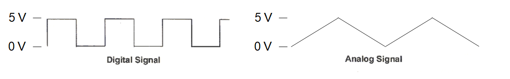
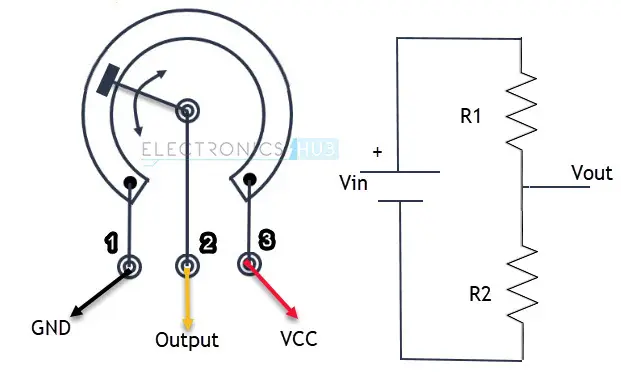

# Základy jazyka C, analogový vstup Arduina

### Cíle lekce
- Vytvořit proměnnou, zapisovat do ní a číst z ní
- Používat pro opakovaný kód cyklus for nebo while
- Použít komunikaci přes sériový port k ověření funkce programu
- Umět využívat funkci analogRead() pro měření napětí


<script type="text/javascript" id="MathJax-script" async 
  src="https://cdn.jsdelivr.net/npm/mathjax@3/es5/tex-svg.js"> 
</script> 

## Proměnné
Proměnná je pojmenované místo v paměti, kam můžeme uložit a kdykoliv změnit hodnotu.

Při pojmenovávání proměnných si dávejte pozor, aby jména měla smysl a popisovala, co proměnná obsahuje. Např. místo názvu ```x``` nebo ```a``` použijte něco jako ```teplota```, ```pocetHracu```, ```stavTlacitka``` – to pomůže, aby byl kód přehledný a snadno pochopitelný pro ostatní (i pro vás v budoucnu).

```c
// Příklad vytvoření a změny hodnoty proměnné
int cislo = 10;  // Proměnná "cislo" obsahuje hodnotu 10
cislo = 20;      // Změníme hodnotu na 20
cislo = cislo/2; // Vydělíme obsah proměnné 2
```

V jazyce C musíme při vytvoření proměnné zadat i její datový typ. Ten vybereme podle toho, jaká data chceme do proměnné ukládat.

| Datový typ       | Velikost | Popis |
|------------------|---------|-----------------------------------------------------------|
| `char`          | 8 bit   | Znak, nabývá hodnoty jednoho ASCII znaku (-128 až 127).  |
| `byte`          | 8 bit   | Ukládá 8bitové číslo v rozsahu (0 až 255).               |
| `boolean`       | 8 bit   | Logická hodnota `true` (1) / `false` (0).               |
| `int`           | 16 bit  | Celé číslo (-32 768 až 32 767).                         |
| `unsigned int`  | 16 bit  | Pouze kladná čísla (0 až 65 535).                       |
| `long`         | 32 bit  | Celé číslo (-2 147 483 648 až 2 147 483 647).           |
| `unsigned long` | 32 bit  | Pouze kladná čísla (0 až 4 294 967 295).                |
| `float`        | 32 bit  | Desetinné číslo (-3.4028235e38 až 3.4028235e38).        |
| `double`       | 64 bit  | Desetinné číslo s dvojnásobnou přesností.               |
| `string`       | různé   | Datový typ pro uchování textového řetězce.              |


## Sériová linka

`Serial.print()` se používá k odeslání dat do seriového monitoru. Můžete tak zobrazit hodnoty proměnných, zprávy nebo výsledky výpočtů během běhu programu.

- `Serial.print("text");` – vypíše text do seriového monitoru.  
- `Serial.print(variable);` – vypíše hodnotu proměnné.  
- `Serial.println()` Funguje stejně jako Serial.print() ale na konci přejde na nový řádek

### Příklad:
```cpp
int cislo = 5; // Proměnná, kterou poté budeme posílat

void setup()
{
Serial.begin(9600);
}

void loop()
{
Serial.print("Hodnota promenne cislo je: ");
Serial.println(cislo);  // Vytiskne "Hodnota x je: 10" a přejde na nový řádek
}
```

## Úkoly
1. Do programu s blikáním LEDky přidejte odesílání jednotlivých stavů (svítí/nesvítí) do serial monitoru.
2. Připojte k Arduinu tlačítko a napište program, který každých 500ms odesílá do sériového monitoru informaci o tom, zda je tlačítko stisknuto.
3. Napište program, který neustále inkrementuje (zvyšuje) hodnotu proměnné a posílá její hodnotu do sériového monitoru. Pomocí volby typu proměnné nebo velikosti inkrementu zajistěte, aby došlo k jejímu přetečení.

## Podmínka, příkaz if-else

```c
int cislo=0;

void setup()
{
    Serial.begin(9600);
}

void loop()
{
    cislo++;
    if (cislo < 10) // Podmínka
    {
        Serial.println("Číslo je malé."); // Podmínka platí -> vypíše se text
    }
    else // Prvotní podmínka je neplatná
    {
        Serial.println("Číslo je velké."); // Podmínka neplatí -> vypíše se jiný text
    }
}
```

## Vícenásobná podmínka 
```c
int cislo=0;

void setup()
{
    Serial.begin(9600);
}

void loop()
{
    if (cislo > 0) {
        Serial.println("Číslo je kladné.");
    } else if (cislo < 0) {
        Serial.println("Číslo je záporné.");
    } else {
        Serial.println("Číslo je nula.");
    }
}
```


## Cyklus for
Pokud chceme nějakou část kódu opakovat můžeme použít for cyklus.
```c
for (inicializace; podmínka; aktualizace) {
    // kód, který se opakuje
}
```

Popis částí:
- Inicializace: Nastaví počáteční hodnotu proměnné (např. int i = 0)
- Podmínka: Kontroluje, jestli má cyklus pokračovat (např. i < 5)
- Aktualizace: Změní hodnotu proměnné po každé iteraci (např. i++)


Příklad for cyklu
```c
void setup() {
  Serial.begin(9600);  // Spustíme sériovou komunikaci

  // Kód v těle cyklu se provede 5x,  pro hodnoty i 0,1,2,3,4
  for (int i = 0; i < 5; i++) {
    Serial.print("Číslo: ");
    Serial.println(i);
  }
}

void loop() {
  // loop je prázdná, protože výpis se provede jen jednou při startu
}

```

## Cyklus while

Další typ cyklu je while. Zatímco for používáme, když víme kolikrát se má cyklus opakovat, while je lepší, když nevíme předem, kdy má cyklus skončit (čekání na vstup, tlačítko atd.).

```c
const int buttonPin = 7;  // Pin, kam je připojené tlačítko
int buttonState = 0;       // Proměnná pro stav tlačítka

void setup() {
  Serial.begin(9600);       
  pinMode(buttonPin, INPUT);  // Nastavíme pin tlačítka jako vstup

  int i = 0;  

  // Cyklus běží, dokud není tlačítko stisknuté
  while (digitalRead(buttonPin) == HIGH) {  
    Serial.print("Číslo: ");
    Serial.println(i);
    i++;
    delay(500);
  }

  Serial.println("Tlačítko stisknuto, cyklus ukončen!");
}

void loop() {
  // Nic, program skončil v setupu
}
```

## Úkoly
1. Pomocí cyklu vypište do sériového monitoru čísla od 0 do 15 včetně
2. Pomocí cyklu vypište do sériového monitoru čísla od 10 do -5
3. Pomocí cyklu vypište do sériového monitoru sudá čísla od 2 do 20 včetně
4. Napište program, který po startu čeká, dokud není stisknuto tlačítko, pak 25x blikne LEDkou


## Analogový vstup
Digitální signál je nespojitý, má jen určité hodnoty (např. 0 a 1). Naproti tomu analogový signál je spojitý – může nabývat jakékoli hodnoty v čase. Příklad: zvukový signál v mikrofonu nebo napětí z teplotního čidla. 


Pro měření digitálního stavu pinu můžeme použít kterýkoli IO pin Arduina. Ovšem pro měření analogového signálu můžeme použít pouze piny označené písmenem A0-A7. Ty totiž lze připojit k AD převodníku na čipu mikroprocesoru (viz. [lekce ADC v MIT](https://tomaschovanec.github.io/MIT/13_ADC.html))

## Funkce analogRead()

Pro měření napětí použijeme funkci `analogRead()`. Jako argument funkci zadáme číslo pinu, na kterém chceme měřit. 
Tedy např. ```int napeti = analogRead(A4);```

Arduino má **10bitový A/D převodník**, což znamená, že dokáže rozlišit **$$2^{10} = 1024$$** úrovní napětí.

- Hodnota **0** odpovídá **0 V**.  
- Hodnota **1023** odpovídá **5 V**.  
- Jeden „dílek“ tedy představuje:  

$$  
\Large \frac{5V}{1024} = 4,88 \text{ mV}  
$$  

Například pokud `analogRead()` vrátí hodnotu **724**, vypočítáme napětí takto:  

$$  
\Large724 \times 4.88 \text{ mV} = 3,53 \text{ V}  
$$  

Napětí na vstupu je tedy přibližně 3,53 V.

## Potenciometr
Potenciometr je nastavitelný rezistor, který umožňuje plynule měnit odpor v obvodu. Má tři vývody – dva krajní pro pevný odpor a střední (jezdec), kterým nastavujeme hodnotu odporu mezi jedním krajem a jezdcem. Tím, že měníme odpor, měníme i napětí v obvodu (dělič napětí).



*Zdroj obrázku: https://www.electronicshub.org/how-potentiometer-works/*

## Úkoly
1. Zapojte k Arduinu potenciometr, čtete hodnotu funkcí analogRead do proměnné a posílejte na sériovou linku
2. Hodnotu převeďte na napětí ve voltech a pošlete na sériovou linku
3. Pokud je vyšší než 2,5V, rozsviťte LEDku
4. Potenciometrem měňte frekvenci blikání LEDky

## [Zpět na obsah](README.md)
