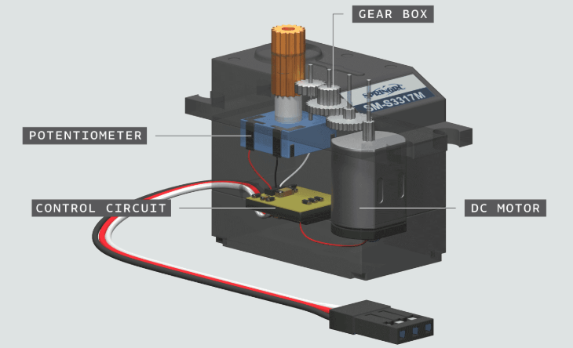
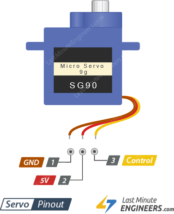
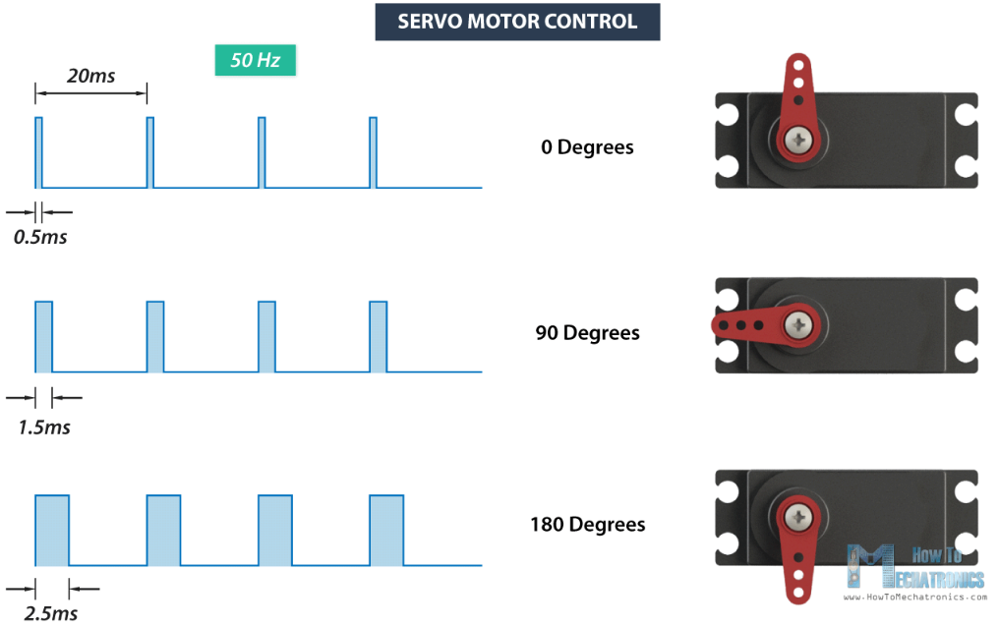
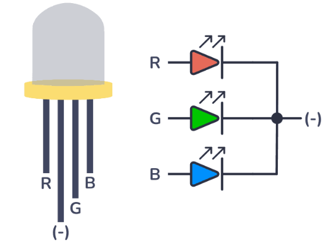
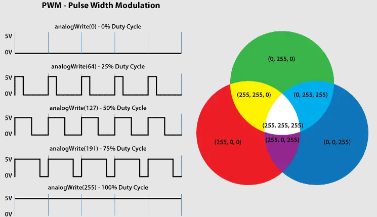

# Servomotor
Je to malý motor s převodovkou, který umí přesně natočit hřídel do určitého úhlu (většinou 0–180°).
Uvnitř najdeme:
- DC motor – pohon
- Převodovku – zpomalí a zvýší moment (sílu serva)
- Elektroniku s potenciometrem – hlídá polohu



*Zdroj obrázku: https://docs.arduino.cc/tutorials/generic/basic-servo-control/*

## Zapojení serva



*Zdroj obrázku: https://lastminuteengineers.com/servo-motor-arduino-tutorial/*

## Řízení serva
Servo se ovládá pomocí PWM signálu – konkrétně šířkou impulzu.

Perioda trvá 20 ms (50 Hz). Délka impulzu určuje úhel:

0,5 ms → Servo na 0°

1,5 ms → 90° (střed)

2,5 ms → 180°

Arduino knihovna Servo tuto práci zjednodušuje:
servo.attach(pin) — určí, na který pin je servo připojené.
servo.write(úhel) — nastaví úhel (0 až 180°).


*Zdroj obrázku: https://lastminuteengineers.com/servo-motor-arduino-tutorial/*



*Zdroj obrázku: https://howtomechatronics.com/how-it-works/how-servo-motors-work-how-to-control-servos-using-arduino/*


## Program pro servo

```c
#include <Servo.h>  // Přidáme knihovnu Servo

Servo servo1; // Vytvoříme si objekt serva

void setup() {

  servo1.attach(2);  // Nastavíme číslo pinu, kde je servo připojeno

}

void loop() {

    servo1.write(0); // Nastaví servo do polohy 0°
    delay(500);     // Počkáme dostatečně dlouho, než servo dosáhne požadované pozice                 

    servo1.write(90);  // Nastaví servo do polohy 90°    
    delay(500);        // Počkáme dostatečně dlouho, než servo dosáhne požadované pozice            

}
```

### Úkoly:
1. Připojte k Arduinu servo, použijte program z příkladu výše a zkuste upravovat časy a úhly.
2. Vytvořit program, který bude servem pohybovat od 0°do 180° plynule (změní úhel vždy jen o jeden stupeň)
3. Připojte k Arduinu servo a potenciometr. Polohu serva nastavujte pomocí potenciometru. Můžete pro to použít funkci map() kterou najdete níže.


## Funkce map()
Funkce map() v Arduinu slouží k převedení hodnoty z jednoho rozsahu do druhého. To je užitečné, když máme třeba hodnotu z analogového vstupu (0 až 1023) a chceme ji převést na jiný rozsah, třeba pro servo (0 až 180 stupňů) nebo pro jas LEDky (0 až 255).

Použití funkce:

```long map(long value, long fromLow, long fromHigh, long toLow, long toHigh);```

```value```: vstupní hodnota, kterou chceme převést

```fromLow```, ```fromHigh```: původní rozsah hodnot

```toLow```, ```toHigh```: nový rozsah hodnot

Příklad použití:
```c
int potValue = analogRead(A0);  
int angle = map(potValue, 0, 1023, 0, 180);  
servo.write(angle);
```

analogRead() vrátí hodnotu od 0 do 1023
map() ji převede na úhel od 0 do 180 stupňů pro servo

## PWM s Arduinem - funkce analogWrite()
PWM (Pulse Width Modulation) je metoda, která mění průměrnou hodnotu napětí rychlým zapínáním a vypínáním signálu. 

Čím déle je signál v logické 1 (zapnutý), tím vyšší je výsledné napětí.

Čím kratší je zapnutý stav, tím nižší je výsledné napětí.

V Arduinu můžeme PWM snadno nastavovat pomocí funkce analogWrite():

```analogWrite(pin, hodnota);```

```hodnota``` je od 0 (0%) do 255 (100%)
```pin```je označení pinu, na kterých PWM nastavujeme :warning:Pozor, funkce analogWrite je dostupná pouze pro některé piny. Ty jsou označené na desce znakem vlnovky. U Arduino UNO jsou to piny 3, 5, 6, 9, 10, a 11.

## RGB LED
RGB LED jsou vlastně 3 LEDky v jednom pouzdře – červená (R), zelená (G) a modrá (B).

Každou barvu můžeme ovládat zvlášť. Pokud k tomu použijeme PWM, můžeme kombinací intenzit jednotlivých barevných složek namíchat různé barvy.



*Zdroj obrázku: https://www.build-electronic-circuits.com/rgb-led/*



*Zdroj obrázku: https://howtomechatronics.com/tutorials/arduino/how-to-use-a-rgb-led-with-arduino/*

### Úkoly:
1. Připojte k Arduinu LEDku a přecházejte mezi 3 stavy - LEDKa je zhasnutá, ledka svítí na 50%, LEDka svítí na 100%.
2. Připojte k Arduinu LEDku a plynule nastavujte její jas od minima do maxima a zpět
3. Připojte k Arduinu LEDku a potenciometr. Podle polohy potenciometru nastavujte jas LEDky funkcí analogWrite().
4. Nastavte na RGB LEDce růžovou barvu.
5. Pomocí cyklu for měňte plynule barvu LEDky z modré na zelenou a zpět.
6. Pomocí tří potenciometrů nastavujte všechny tři barevné složky RGB LEDKy.

## [Zpět na obsah](README.md)
