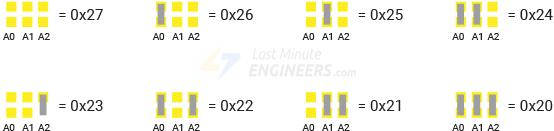
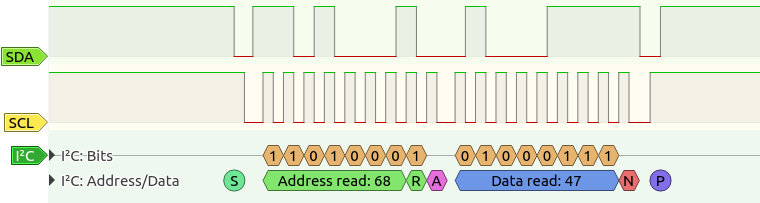

## Teplotní a vlhkostní čidlo DHT11


DHT11 je jednoduché digitální čidlo, které měří teplotu a vlhkost. Připojuje se k Arduinu 3 piny: VCC, GND, DATA. Má plastové pouzdro s otvory pro proudění vzduchu a uvnitř obsahuje:

- **Teplotní senzor** — umožňuje měřit teplotu v rozsahu 0–50 °C s přesností ±2 °C.
- **Senzor vlhkosti** — umožňuje měřit relativní vlhkost v rozsahu 20–90 % s přesností ±5 %.
- **Integrovaný obvod** — měří vlhkost a teplotu pomocí dvou výše zmíněných čidel a data posílá digitálně po jediném datovém pinu.


*Zdroj obrázků: https://howtomechatronics.com/tutorials/arduino/dht11-dht22-sensors-temperature-and-humidity-tutorial-using-arduino/ *


## Přidání knihovny do Arduina

Knihovny v Arduinu jsou předpřipravené balíčky kódu, které usnadňují práci s různými senzory, moduly nebo složitějšími funkcemi. Díky tomu nemusíme psát všechno od nuly, knihovna se postará o složitější části programu, např. komunikaci se senzorem. 

Knihovny také zpravidla obsahují příklady použití (**Examples**). Najdeme je přes menu **File -> Examples -> Název knihovny** . Z  příkladů můžeme snadno pochopit, jak pracovat s danou knihovnou.

### Přidání knihovny pomocí Library manageru

- V horním menu vyberte Tools > Manage Libraries…
- Do vyhledávacího pole napite název knihovny (nebo část názvu). Seznam knihoven se bude filtrovat podle toho, co píšte.
- Výsledky jsou seřazené abecedně, takže možná budete muset posunout dolů, než ji najdete.
- Nainstalujte knihovnu: Klikněte na zvolenou knihovnu. Můžete si přečíst popis a jméno autora. Pak klikněte na "Install". Arduino IDE automaticky vybere nejnovější verzi knihovny.

### Úkoly:
1. Pomocí Library manageru si nainstalujte knihovnu DHTlib (autor Rob Tillaart).
2. Připojte k Arduinu sensor DHT11 a zobrazujte naměřená data v Serial monitoru. Použijte příklad níže, nezapomeňte správně nastavit číslo pinu, kam jste čidlo připojili.

```c
#include <dht.h>        // Include library

dht sensor;             // Creates a DHT object
int outPin = 2;        // Defines pin number to which the sensor is connected

void setup() {
	Serial.begin(9600);
}

void loop() {
	int readData = sensor.read11(outPin);	// Starts the conversion

	float temp = sensor.temperature;        // Read temperature
	float humid = sensor.humidity;           // Read humidity

	Serial.print("Temperature = ");
	Serial.print(temp);
	Serial.print("°C ");
	Serial.print("Humidity = ");
	Serial.print(humid);
	Serial.println("% ");
	Serial.println("");

	delay(2000); // wait two seconds
}
```


## LCD displej s I2C modulem a knihovnou [LiquidCrystal_I2C](https://github.com/fdebrabander/Arduino-LiquidCrystal-I2C-library)

[Knihovna ke stažení zde](https://github.com/fdebrabander/Arduino-LiquidCrystal-I2C-library/archive/refs/heads/master.zip)

### Přidání knihovny ze zip souboru
- V horním menu vyberte: Sketch > Include Library > Add .ZIP Library…
- V dialogovém okně najděte soubor s knihovnou s příponou .zip a klikni na Open.
- Knihovna se automaticky rozbalí a přidá mezi ostatní knihovny. Najdete ji pak v Sketch  → Include library.




*Zdroj obrázku:  https://lastminuteengineers.com/i2c-lcd-arduino-tutorial/*

## I2C sběrnice
I2C (Inter-Integrated Circuit) je sériová sběrnice, která umožňuje komunikaci mezi více zařízeními (senzory, displeje, moduly) pomocí pouze dvou vodičů:
- SDA (Data) – přenáší data mezi zařízeními.
- SCL (Clock) – řídí časování přenosu dat.

Výhody I2C s Arduinem
- Úspora pinů – stačí jen 2 dráty pro připojení více zařízení (každé má unikátní adresu).
- Jednoduché zapojení – méně kabelů, méně zmatků.
- Podpora knihoven – Arduino má knihovny jako Wire.h pro snadné ovládání.
- Možnost rozšíření – připojení až 128 zařízení na stejnou sběrnici (adresy 7bit).
- Obousměrná komunikace – Master (Arduino) může posílat i přijímat data.
 

 
*Zdroj obrázku: https://www.hibit.dev/posts/102/communication-protocols-uart-i2c-and-spi*


 
### Použití knihovny [LiquidCrystal_I2C](https://github.com/fdebrabander/Arduino-LiquidCrystal-I2C-library)

```#include <LiquidCrystal_I2C.h>``` Načte knihovnu pro ovládání LCD displeje s I2C adaptérem.

```LiquidCrystal_I2C lcd(0x27, 16, 2);``` Vytvoří objekt lcd s adresou 0x27. 16, 2 znamená, že displej má 16 sloupců a 2 řádky.

```lcd.begin();``` Inicializuje displej — připraví ho na použití.

```lcd.clear();```  Vyčistí obsah displeje.

```lcd.setCursor(0,1);``` Nastaví kurzor na 1. sloupec (indexuje se od 0) a 2. řádek.

```lcd.print("Hello world!");```  Vypíše text "Hello world!" od zadané pozice kurzoru.


### Úkoly:
1. Připojte k Arduinu sensor DHT11 a zobrazujte naměřená data v Serial monitoru.
2. Připojte k Arduinu LCD displej a zobrazte na první řádek své jméno, na druhý příjmení
3. Zobrazte na displeji odpočet od 10 do 0 po 0,5s. Po skončení odpočtu zobrazte libovolný vzkaz.
4. Na LCD displeji zobrazujte na jednom řádku teplotu, na druhém vlhkost.
5. Použijte pro zobrazení teploty znak °C. Vysvětlení, jak zobrazovat speciální znaky najdete například [zde](https://arduino.stackexchange.com/questions/46828/how-to-show-the-%C2%BA-character-in-a-lcd).
6. Na displeji zobrazujte aktuální teplotu a pak také minimální a maximální teplotu od startu programu.
7. Vytvořte program, který sleduje teplotu z DHT11 a porovnává ji s limitem. Limit se bude nastavovat potenciometrem. Pokud teplota překročí tento limit, na LCD se zobrazí varování. Na LCD zobrazujte aktuální teplotu i nastavený limit.
   

## [Zpět na obsah](README.md)
