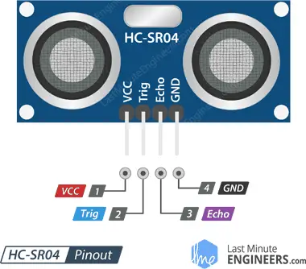

# Ultrazvukový sensor HC-SR04
V dnešní lekci se naučíme pracovat se senzorem HC-SR04, který umožňuje měření vzdálenosti pomocí ultrazvuku. 

Hlavní parametry senzoru:

| Parametr              | Hodnota           |
|-----------------------|------------------|
| Napájecí napětí       | 5V               |
| Proudový odběr   | ~15 mA           |
| Frekvence ultrazvuku | 40 kHz       |
| Měřicí rozsah    | 2 – 400 cm       |
| Přesnost         | ±3 mm            |
| Úhel detekce     | ~15°             |
| Rozhraní         | 2 digitální piny (Trig, Echo) |

## Princip senzoru


*Zdroj obrázku: https://howtomechatronics.com/tutorials/arduino/ultrasonic-sensor-hc-sr04/*

### Zapojení
Kromě obligátního +5V napájení a GND musíme čidlo připojit ke dvěma libovolným digitálním pinům Arduina. **Pin Trig** slouží ke spuštění měření (vyslání ultrazvukového pulzu), musíme jej tedy v Arduinu nastavit jako výstup. **Pin Echo** je výstup senzoru (tedy z pohledu Arduina vstup), na kterém senzor generuje puls, jehož délka odpovídá době od vyslání signálu do návratu odražené vlny.



### Průběh signálu na pinech Trig a Echo:


### Funkce pulseIn()
Abychom zjistili změřenou vzdálenost, potřebujeme změřit délku pulzu na pinu Echo. Mohli bychom pro to použít periferii mikrokontroleru časovač, ale usnadníme si práci využitím standartní funkce Arduino pulseIn(). Funkce vyžaduje dva argumenty -  na jakém pinu chceme pulz měřit a zda chceme měřit délku HIGH nebo LOW pulzu.

```c
int pin = 7;
unsigned long duration;

void setup() {
  Serial.begin(9600);
  pinMode(pin, INPUT);
}

void loop() {
  duration = pulseIn(pin, HIGH);
  Serial.println(duration);
}
```

### Úkoly
1. Připojte k Arduinu ultrazvukový senzor. Měřte vzdálenost a změřenou hodnotu posílejte na serial monitor.
2. Přidejte navíc LCD displej a naměřenou hodnotu na něm zobrazujte v centimetrech. Připojte Arduino na powerbanku a zkuste změřit i větší vzdálenosti v místnosti. Ověřte limity senzoru.


# Definice vlastní funkce v jazyce C 
Funkce v jazyce C slouží k rozdělení programu na menší, přehlednější části, které lze znovu použít.

Hlavní výhody funkcí:
- Zjednodušují kód – program je přehlednější a lépe organizovaný.
- Umožňují opakované použití kódu – stejnou funkci lze volat vícekrát, čímž se snižuje duplicita.
- Usnadňují ladění a údržbu – chyby se hledají snadněji, protože jsou izolovány v konkrétní funkci.
- Podporují modulární programování – umožňují rozdělit kód na logické bloky, což zlepšuje strukturu programu.

Funkce mají název, mohou (ale nemusí) přijímat argumenty a vracet hodnotu.

### Funkce bez parametru a návratové hodnoty
Vytvoříme jednoduchou funkci. Klíčové slovo void před názvem funkce označuje, že funkce nevrací žádnou hodnotu. ```void```v závorkách pak znamená, že funkce nepřijímá žádné vstupní argumenty.

```c
void pozdrav(void)
{
    Serial.println("Dobrý den!");
}

void setup() {
    Serial.begin(9600);
}

void loop() {
    pozdrav();
    delay(1000);
}
```

### Funkce s parametrem
Funkce může mít libovolný počet vstupních parametrů (také nazývaných argumenty), které se zapisují do závorek při její definici. Parametry umožňují funkci přizpůsobit její chování podle konkrétních hodnot. Příklad: Pokud chceme aby funkce z předchozího příkladu pozdravila s oslovením jménem, přidáme do funkce parametr ```jmeno```, který následně použijeme v těle funkce. Při volání funkce pak tento parametr předáme s konkrétní hodnotou.

```c
void pozdrav(char jmeno[]) {
    Serial.print("Dobrý den ");
    Serial.print(jmeno);
    Serial.println("!");
}

void setup() {
    Serial.begin(9600);
}

void loop() {
    pozdrav("Horymíre");
    pozdrav("Petro");
    delay(1000);
}

```

### Návratová hodnota funkce
Funkce může také vracet hodnotu. Vytvořme například funkci, která spočítá obsah obdélníku. Tento výsledek ale nebudeme pouze vypisovat přes sériovou linku, ale chceme ho použít v dalších výpočtech. Proto jej místo vypsání vrátíme jako návratovou hodnotu. Funkce vrací hodnotu pomocí příkazu ```return```, který zároveň ukončí její vykonávání. Kód za příkazem ```return``` se již neprovede. Při definici funkce je nutné uvést datový typ návratové hodnoty.

```c
int obsah_obdelniku(int sirka, int vyska)
{
    int vysledek = sirka * vyska;
    return vysledek;
}

void setup() {
    Serial.begin(9600);
}

void loop() {
    int sirka = 5;
    int vyska = 10;
    int obsah = obsah_obdelniku(sirka, vyska);
    Serial.print("Obsah obdélníku: ");
    Serial.println(obsah);
    delay(1000);
}
```

## Úkoly
1. Vytvořte funkci pro blikání LEDkou ```blikej(int pocet_bliknuti, int delka_bliknuti)``` Aby například kód ```blikej(5, 200);``` bliknul LEDkou 5x s periodou 200 ms.
2. Pro snadnější práci s ultrazvukovým senzorem vytvořte funkci ```zmer_vzdalenost()```, která bude vracet délku v centimetrech.


## [Zpět na obsah](README.md)
