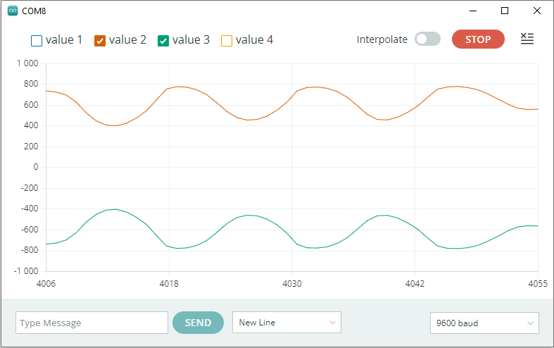
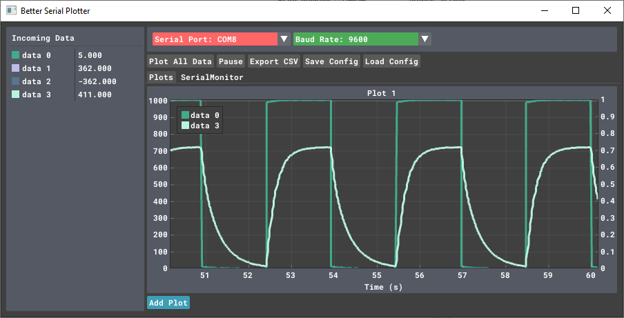
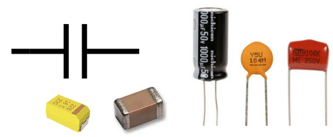
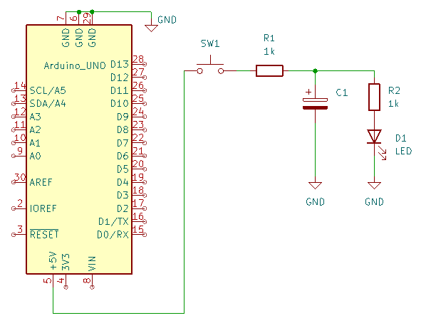
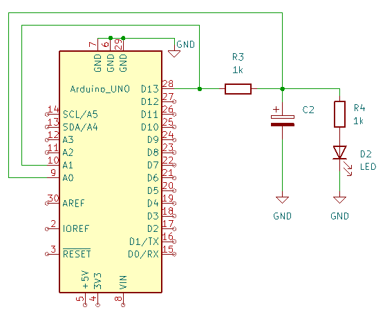

## Arduino jako jednoduchý měřící přístroj
Arduino má mnoho vstupů, na kterých dokáže měřit jak digitálně stav logické 1 nebo 0, tak i několik analogových pinů, schopných měřit napětí od nuly do 5V. Lze ho tedy použít jako jednoduchý měřící přístroj. Může kontinuálně měřit data a posílat je do počítače, který už je dále zpracuje (uloží, zobrazí, vykreslí graf,...)


V této lekci si ukážeme, jak z arduina udělat jednoduchý osciloskop, vykreslíme průběh napětí na kondenzátoru při nabíjení a vybíjení.


## Serial Plotter     

Pro zobrazování měřených dat máme možnost využít nástroj **Serial Plotter**, který je standartní součástí Arduino IDE (ikonka hned vedle Serial Monitoru). Na základní zobrazení signálu se dá použít, neumí ale třeba nastavit rozsah osy Y nebo zoomovat v zobrazeném grafu atd.



### Úkoly:
1. Připojte k Arduinu potenciometr, měřte na něm napětí funkcí analogRead() a posílejte naměřená data po sériové lince (použijte rychlejší baudrate 115200 bps). Pak je zobrazte pomocí Serial Plotteru v Arduino IDE
2. Přidejte druhý kanál - opačnou hodnotu potenciometru

## Better Serial Plotter
Pro více funkcí můžeme zkusit program [Better Serial Plotter](https://github.com/nathandunk/BetterSerialPlotter) ke stažení [zde](https://github.com/nathandunk/BetterSerialPlotter/releases/download/v0.1.2/BetterSerialPlotter-v0.1.2-Windows.zip)

V programu stačí vybrat sériový port, na kterém je připojeno Arduino. Formát dat je stejný jako pro Serial Plotter - stačí tedy posílat pokaždé jeden řádek dat, pokud je čísel více, mohou být odděleny mezerou.

:warning: Protože v jednu chvíli může být k sériovému portu připojen jen jeden program, ve chvíli, kdy zobrazujete data v Serial Plotteru, nemůžete do Arduina nahrát nový program. Je nutné vždy předtím Serial Plotter buď zavřít, nebo v něm nastavit jiný port.




### Úkol:
1. Použijte program Better Serial Plotter pro zobrazení dat z potenciometru


## Kondenzátor


Kondenzátor se ve stejnosměrném obvodu chová jako zásobník energie.P o připojení ke zdroji napětí se začne rychle nabíjet a protéká jím velký proud. Jakmile se jeho napětí vyrovná s napětím zdroje, proud klesne na minimální hodnotu. Pak kondenzátor uchovává elektrický náboj a může dodávat energii do obvodu (fungovat jako zdroj). Při vybíjení postupně ztrácí náboj a napětí na něm exponenciálně klesá.

Kondenzátor nepropouští stejnosměrný proud po úplném nabití, ale umožňuje přenos změn napětí (to je důležité v AC obvodech).

:warning: U elektrolytického kondenzátoru musíme dodržet správnou polaritu, jinak dojde ke zničení kondenzátoru s možnou [explozí](https://www.youtube.com/watch?v=rr7bPmGTQUk&ab_channel=ElectroBOOM)


### Úkoly:
**1.** Proveďte zapojení podle schématu, kondenzátor nejdříve vynechte
- Ověřte, že po stisku tlačítka svítí LEDka
- Připojte k LEDce a rezistoru paralelně kondenzátor
- Zkuste opět tlačítkem připojovat a odpojovat 5V. Popište, co se děje



**2.** Nyní upravte zapojení tak, abychom obvod nenapájeli přes tlačítko z +5V, ale z pinu D13.
- Naprogramujte Arduino, aby se na pinu 13 střídala log. 1 a log. 0 každou sekundu
- Pomocí analogových pinů měřte napětí na pinu D13 a napětí na kondenzátoru
- Naměřené hodnoty posílejte na sériový port a zobrazujte pomocí programu Better Serial Plotter.

Protože pokud bychom pro blikání používali funkci delay(), procesor by měřil data jen jednou za sekundu, použijeme pro blikání fuknci millis():
 ```c
unsigned long previousMillis = 0;  // poslední čas, kdy se LEDou blinkulo
int ledPin = 13;
 
void setup() {
  pinMode(ledPin, OUTPUT);
}

void loop() {
 
  unsigned long currentMillis = millis(); // uloží současný čas
  if (currentMillis - previousMillis >= 1000) { //pokud od minulého blinkutí uplynulo více než 1s
    digitalWrite(ledPin, !digitalRead(ledPin)); // zneguje stav LEDky
    previousMillis = currentMillis; // uloží nový čas posledního bliknutí
  }
}
```



## Další užitečné články a videa

[Video o kondenzátorech](https://www.youtube.com/watch?v=K_MFUkW1-Qo&ab_channel=N%C3%A1zorn%C3%A1elektrotechnika) (a o tom, proč některé vybuchují při nesprávné polaritě)
