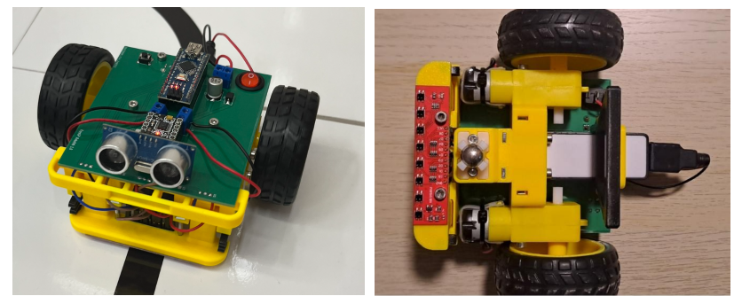

# Robot - sledovač čáry

## Cíl
Naprogramujte robota tak, aby sledoval černou čáru na světlém podkladu. Využijte analogové IR senzory, které detekují odrazivost povrchu pod nimi. 

## Princip funkce
IR senzory na školním robotovi jsou analogové. Můžeme je tedy měřit AD převodníkem a výstup každého čidla se bude měnit podle toho, jakou odrazivost má povrch pod ním. Protože černá čára odráží světlo méně než bílý podklad, lze tak detekovat, pod kterými čidly se čára nachází. Poté nastavíme rychlost motorů podle polohy čáry.

Například:
- pokud je čára pod pravým senzorem → zatočíme doprava,
- pokud je čára uprostřed → jedeme rovně,
- pokud je pod levým senzorem → zatočíme doleva.

## Postup
1. Zjistěte ze [schématu](https://github.com/TomasChovanec/Arduino_robotek/blob/master/FrenGP_robot/Robot_schematics.pdf) na které piny jsou připojeny IR sensory. Pomocí funkce analogRead() měřte napětí na nich a posílejte je na sériový port.
2. Nyní jsme schopni měřit hodnotu odrazu na všech pěti čidlech. Potřebujeme zjistit, na které pozici je čára, abychom pak podle toho mohli nastavit rychlost motorů. Jedna z možností je najít maximální hodnotu senzoru.
3. Pro nastavení rychlosti motorů pro všechny různé polohy čáry můžeme použít příkaz [switch](https://www.itnetwork.cz/hardware-pc/arduino/programovaci-jazyk/podminky-a-jejich-pouziti#_switch). Například pokud je čára vlevo, musí robot zabočit doleva, tedy nastavit na pravém motoru větší rychlost než na levém.

## Tipy	
- Pokud robot ztratí čáru, nech ho otáčet na místě a hledat ji.
- Pro rychlejší a plynulejší pohyb robota můžete použít PID regulaci. Nastudujte si stručně o co se jedná a zkuste ji implementovat.
