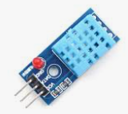

# Samostatný projekt
Projekt sestává z vytvoření fyzického zapojení s Arduinem a alespoň dvěmi periferiemi (motory, displeje, čidla, ...) a vytvoření programu.
Projekt budete vypracovávat převážně doma, na hodinách bude vyhrazen prostor pro dotazy a řešení problémů. Konzultovat se mnou můžete také kdykoli prostřednictvím aplikace Teams.

## Využití AI nástrojů

### AI je váš konzultant, ne řešitel
Můžete ho používat k vysvětlení nejasností, nalezení chyb, získání nápadů na postup nebo pochopení principů. Nesmíte ale pouze zadat celé zadání a použít odpověď jako hotové řešení.
Pokud něco nechápete, zeptejte se modelu tak, abyste dostali vysvětlení (např. „Proč mi tenhle cyklus končí o jeden krok dřív?“, „Jaký je rozdíl mezi analogRead a digitalRead?“).

### Dokumentujte použití
Každé využití AI, které vám pomohlo, stručně popište v závěrečné zprávě/projektu. Např.: „LLM jsem použil k vysvětlení funkce map().“nebo  „LLM mi pomohl najít chybu v syntaxi if podmínky.“

### Buďte schopni obhájit řešení
Pokud v kódu nebo projektu použijete nápad z AI, musíte být schopni vysvětlit, proč to tam je a jak to funguje. Během prezentace se na to budu ptát, viz. hodnocení projektu. V extrémním případě, pokud nebudete tušit, jak program funguje a bude zjevné, že vzninl jen zkopírováním výsledku vygenerovaného z kompletního zadání, nebude projekt přijat a pokud nebude do dalšího termínu přepracován, bude hodnocen známkami 5.

## Hodnocení
- Jedna známka s váhou 1.0 za samotný projekt (fyzické zapojení a program) a jeho prezentaci
    - Funkčnost, splnění všech bodů zadání (7 bodů)
    - Znalost toho, jak program funguje (prokázání, že kódu rozumíte a pouze jste jej bez pochopení nezkopírovali) (8 bodů)
    - Včasné odevzdání (5 bodů)
    - Prezentace před třídou včetně předvedení funkčnosti (5 bodů)
    
- Druhá známka s váhou 1.0 za dokumentaci projektu
    - **pdf** dokument pojmenovaný **Jmeno_Prijmeni_trida.pdf** [dle šablony](/files/Praxe_projekt_vzor.pdf) (1 bod) obsahující:
        - **Zadání** - kompletní zadání zkopírované z Githubu (1 bod)
        - **Popis řešení** - několik vět svými slovy o tom, jak jste postupovali při řešení, zda jste vybírali z více variant řešení, jaké nástroje/knihovny jste použili,...) (2 bodů)
        - **Schéma** - můžete použít libovolný program pro kreslení schémat nebo např. online nástroj [wokwi.com](https://wokwi.com/projects/new/arduino-uno) nebo KiCAD či jiný SW pro kreslení schemat. Podstatné je, aby bylo možné podle schematu váš projekt znovu vytvořit někým jiným.
 (10 bodů)
        - **Fotografii** zapojení (2body)
        - **Kód** - přehledně naformátovaný a opatřený komentáři, vložený jako text, nikoli jako obrázek (2 body)
        - **Seznam použitých zdrojů** včetně odkazů na použité knihovny (2 body)
        - **Závěr** - několik vět svými slovy o tom, zda jste splnili všechny body zadání, jaké problémy jste řešili atd. (5 body)

| Body    | Známka|
|---------|-------|
| 25 - 22 | 1     |
| 21 - 16 | 2     |
| 15 - 10 | 3     |
| 9 - 5   | 4     |
| 5 - 0   | 5     |

## Příklady možných projektů (ale vítané jsou vlastní nápady):
- Elektronická hrací kostka
- Elektronické piano
- Ultrazvukový měřič vzdálenosti s funkcí výpočtu plochy
- Hra na postřeh pro dva hráče
- Hodinky s budíkem a stopkami
- Teplotní čidlo se záznamem na SD kartu
- Voltmetr se třemi napěťovými rozsahy
- Ovládání výtahu (krokový motor, tlačítka, displej)
- Otevírání dveří na RFID karty (RFID čtečka, displej, servo)
- Nápojový automat na RFID karty (RFID čtečka, displej, klávesnice, servo)
- Hudební přehrávač s dálkovým ovládáním
- Reklamní banner s maticovým displejem
- Měření kapacity kondenzátorů
- Robot jako sledovač čáry s funkcí objetí překážky
- Přidání funkce počitadla ujeté vzdálenosti pro robota
- Stavba robota podle vlastního návrhu

<!---
- Naprogramování školního robota pro soutěž sumo 
- Časomíra pro závody robotů
- Úprava školního robota pro ovládání joystickem po drátech
--->

## Moduly a součástky pro projekt

Můžete si pro potřeby projektu zapůjčit následující vybavení:

| Komponenta                  | Obrázek                                                                                          | Popis                                                                                  |
|-----------------------------|--------------------------------------------------------------------------------------------------|----------------------------------------------------------------------------------------|
| **Arduino Nano**            |         | Deska se stejným procesorem jako Arduino UNO, které používáme na cvičeních, menší rozměry, dá se zapojit přímo do nepájivého pole |
| **Arduino MEGA**            |         | Deska s ATmega 2560 (stejný jako používáme v MIT) s 56 IO piny, 16 analogovými vstupy  |
| **Arduino Nano 33 IoT**     |         | Arduino s výkonnějším procesorem, Bluetooth a WiFi modulem                             |
| **RTC modul**               |         | Modul reálného času s bateriovým zálohováním, komunikace přes I2C.                     |
| **Datalogger shield**       |         | Shield s RTC modulem a SD kartou, vhodný pro ukládání naměřených dat                   |
| **Piezzo bzučák**           |         | Pro jednoduché zvukové efekty (pípání, tóny,...)                                       |
| **Fotorezistor**            |         | Součástka s odporem závislým na osvětlení                                              |
| **Senzor DHT-10**           |         | Senzor pro měření teploty a vlhkosti                                                   |
| **Bluetooth modul HC-05**   |         | Bezdrátový modul pro sériovou komunikaci přes Bluetooth.                               |
| **Senzor HC-SR04**          |         | Ultrazvukový senzor vzdálenosti rozsah 2cm - 3m                                        |
| **Joystick shield**         |         | Rozšiřující deska s joystickem a několika tlačítky pro ovládání projektů.              |
| **RFID sada**               |         | Modul pro čtení RFID karet a čipů s frekvencí 13.56 MHz.                               |
| **LCD displej**             |         | Znakový LCD displej 16x2 pro zobrazení textových informací.                            |
| **OLED displej**            |         | Malý grafický displej s vysokým kontrastem, komunikace přes I2C                        |
| **Klávesnice**              |         | Membránová klávesnice 4x4                                                              |
| **Školní robot**            |         | Robot s Arduinem, motory, ultrazvukovým senzorem a senzory čáry                        |
| **DC motor s kolem**        |         | Stejnosměrný motor s převodovkou a kolem, vhodný pro stavbu vlastního robota           |
| **Servo**                   |         | Malý servomotor s přesným řízením polohy 0-180°                                        |
| **Krokový motor s řadičem** |         | Motor s přesným krokovým řízením, používaný např. v CNC nebo 3D tisku.                 |
| **Hmotnostní senzor**       |         | Hmotnostní senzor s modulem HX711 (24bit ADC)    do 5kg nebo do 20kg                   |
| **Senzor srdečního tepu**   |         | Senzor srdečního tepu s modulem MAX30100                                               |
| **Modul s MP3 přehrávačem** |         | Modul s MP3 přehrávačem a integrovaným zesilovačem, který může být připojen přímo k reproduktoru. |
| **Maticový displej**        |         | MLED Matrix matice 8x8x4 s MAX7219 - červená                                           |
| **GPS modul**               |         | Modul GPS NEO-6M s anténou                                                             |
| **Ventilátor**              |         | Ventilátor 50mm 5V                                                                     |
| **Senzor proudu**           |         | Senzor INA219 pro měření proudu. Připojení pře I2C                                     |
| **Akcelerometr**            |         | Tříosý akcelerometr GY 521                                                             |
| **Kruh z RGB LEDek**        |         | 24x RGB LED WS2812B                                                                    |

