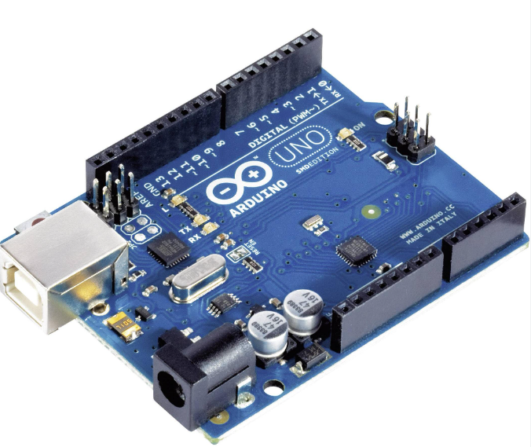

# Praxe - Arduino

Tato stránka slouží k předmětu Praxe, části Arduino vyučovaném ve 3. ročníku na Gymnáziu a Střední průmyslové škole elektrotechniky a informatiky ve Frenštátě pod Radhoštěm.

Pokud máte dotaz k materiálům či výuce, kontaktujte mě prosím na mailu [tomas.chovanec@frengp.cz](mailto:tomas.chovanec@frengp.cz).

## Obecné informace
- [Hodnocení v předmětu](Hodnoceni_predmetu.md)
- [Informace k samostatnému projektu](/projekty/Projekt.md)
- [Zadání T3A sk. 1](/projekty/Zadani_projektu_T3A_sk_1.md)
- [Zadání T3A sk. 2](/projekty/Zadani_projektu_T3A_sk_2.md)

<!---
- [Zadání E3A](/projekty/Zadani_projektu_E3A_sk_1.md)
- [Zadání E3B](/projekty/Zadani_projektu_E3B_sk_1.md)

--->

## Podpůrné materiály
- [Tahák k Arduinu](/files/Arduino_tahak.pdf)
- [Oficiální dokumentace Arduino funkcí](https://docs.arduino.cc/language-reference/)

## Materiály k výuce
1. [Úvod do Arduina, blikání LEDkou, Serial monitor](/lekce/1_lekce.md)
1. [Tlačítka, analogový vstup](/lekce/2_lekce.md)
1. [Servo](/lekce/Servo.md)
1. [PWM, RGB LEDka](/lekce/PWM.md)
1. [LCD displej](/lekce/LCD.md)
1. [Logický analyzer](/lekce/Logicky_analyzer.md)
1. [Teplotní čidlo](/lekce/DHT.md)
1. [Ultrazvukový sensor](/lekce/Ultrasonic.md)
1. [Krokový motor](/lekce/Krokovy_motor.md)
1. [Stejnosměrný motor](/lekce/DC_motor.md)
1. [Bluetooth](/lekce/Bluetooth.md)
1. [Multitasking s Arduinem](/lekce/Millis.md)
1. [Arduino jako měřící přístroj](/lekce/Serial_plotter.md)
1. [Fotorezistor](/lekce/Fotorezistor.md)
1. [Sériový vstup](/lekce/Serial_input.md)
1. [WiFi a IoT](/lekce/Firebase_Nano_IoT.md)
1. [Sledovač čáry](/lekce/Line_follower.md)

<!---
1. [Závěr](/lekce/zaver.md)
--->

<!---
## Rozcvičky
1. [Rozcvička 5.1.](Test_1.md)
1. [Rozcvička 12.1.](Test_2.md)
--->

## Testy
Ukázkové testy s podobným typem zadání, jaké budou v ostrém testu. 

1. [Test 1](Test_1.md)
2. [Test 2](Test_2.md)

