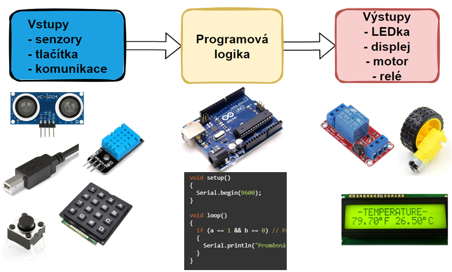

# Úvod do Arduina

### Cíle lekce
- Vysvětlit, co je Arduino, k čemu ho můžeme použít
- Umět použít piny Arduina jako **výstupy** a pomocí funkce ```digitalWrite()``` blikat LEDkou.
- Umět použít piny Arduina jako **vstupy** a pomocí funkce ```digitalRead()``` číst stav tlačítka.
- Umět použít nepájivé pole k propojení součástek a Arduina


## Co je to Arduino?
Arduino je platforma pro výuku a vývoj elektronických projektů. Z hardwarového pohledu je to deska s procesorem, ke které můžete připojit různé senzory, motory, světla a další komponenty, a poté je ovládat pomocí kódu. Programování probíhá v jednoduchém jazyce a jsou k dispozici spousty hotových knihoven, což Arduino činí ideálním nástrojem pro začátečníky i pokročilé, kteří se chtějí naučit základy elektroniky a programování. Arduino se používá ve spoustě projektů, od domácí automatizace po robotiku.

## Hardware
Existuje mnoho typů Arduino desek s různými mikrokontrolery - liší se výkonem, počtem pinů, možnostmi WiFi, Bluetooth atd. V našich hodinách budeme používat Arduino UNO s procesorem ATmega 328.


## Princip fungování embedded systémů
Slovo „embedded“ znamená, že jde o systémy, které jsou součástí nějakého zařízení, například mikrokontrolér v ledničce, autě nebo robotu, který vykonává specifické úkoly.



## Příklad projektu s Arduinem
Dokážete při pohledu na obrázek popsat, k čemu tento projekt slouží a jaký asi program běží v Arduinu?


## Psaní programu pro Arduino - funkce setup() a loop()
```C
//sem prijde vlozeni knihoven, inicializace proměnných...

void setup() {
    // zde vlozte kod, ktery ma bezet pouze jednou

}

void loop() {
    // zde vlozte kod hlavni kod, ktery se bude opakovat donekonecna

}
```

## Blikání LEDkou na desce Arduina
Přímo na desce Arduina je jedna LED, kteoru můžeme z programu ovládat. Je připojena na pin 13. Co budeme potřebovat?

Touto funkcí nastavíme pin 13, kde je připojena LEDka, jako výstup.
```c
pinMode(13, OUTPUT);
```

Touto funkcí přivedeme na pin 13 logickou jedničku (HIGH). Tím se na pin připojí 5V a LEDka se rozsvítí.
```c
digitalWrite(13, HIGH); //zapnutí led
```

Protože mikroprocesor v Arduinu pracuje s frekvencí 16MHz, tak pokud bychom jen neustále měnili stav na pinu, nebylo by blikání pro lidské oko viditelné (viděli bychom jej jen na osciloskopu). Proto přidáme "pauzu", aby oko stihlo vnímat, že LEDka svítí.
```c
delay(1000); // čekání po dobu jedné sekundy
```

Celý program blikání LEDkou:

```c
//sem prijde vlozeni knihoven, inicializace proměnných...
int led = 13;

void setup() {
    // zde vlozte kod, ktery ma bezet pouze jednou
    pinMode(led, OUTPUT);
}

void loop() {
    // zde vlozte kod hlavni kod, ktery se bude opakovat donekonecna
    digitalWrite(led, HIGH); //zapnutí led
    delay(1000); // čekání po dobu jedné sekundy

    digitalWrite(led, LOW); // vypnuti LED
    delay(1000); // čekání po dobu jedné sekundy
}
```

## Přidání další LEDky, nepájivé pole
Na desce Arduina je jen jedna LEDka, kterou můžeme ovládat (pokud nepočítáme LEDky na pinech Tx a Rx, které ale využíváme k programování Arduina). Zkusíme si teď připojit další LEDku s pomocí nepájivého pole. Nesmíme zapomenout na sériový odpor. Jak spočítat jeho velikost?


Nepájivé pole (breadboard) je nástroj, který slouží k rychlému sestavení elektronických obvodů bez nutnosti pájení. Má řadu malých děr, které jsou elektricky propojené, a do těchto děr se zasouvají součástky nebo vodiče. Umožňuje tedy snadno testovat a upravovat obvody.


## Úkoly
**1.** Zapojte do nepájivého pole LEDku s rezistorem. Připojte anodu LEDky na některý digitální pin Arduina (vyberte jeden z pinů 2-12). Napište program tak, aby se vždy po 1s střídavě rozsvěcovala LEDka na Arduino desce (na pinu 13) a LEDka na nepájivém poli.


## Sériová linka

`Serial.print()` se používá k odeslání dat do seriového monitoru. Můžete tak zobrazit hodnoty proměnných, zprávy nebo výsledky výpočtů během běhu programu.

- `Serial.print("text");` – vypíše text do seriového monitoru.  
- `Serial.print(variable);` – vypíše hodnotu proměnné.  
- `Serial.println()` Funguje stejně jako Serial.print() ale na konci přejde na nový řádek

### Příklad:
```cpp
int cislo = 5; // Proměnná, kterou poté budeme posílat

void setup()
{
Serial.begin(9600);
}

void loop()
{
Serial.print("Hodnota promenne cislo je: ");
Serial.println(cislo);  // Vytiskne "Hodnota x je: 10" a přejde na nový řádek
}
```

## Úkoly
1. Otevřete si program s blikáním LEDky a přidejte odesílání jednotlivých stavů (svítí/nesvítí) do serial monitoru.
1. Připojte k Arduinu tlačítko a napište program, který každých 500ms odesílá do sériového monitoru informaci o tom, zda je tlačítko stisknuto.
1. Napište program, který neustále inkrementuje (zvyšuje) hodnotu proměnné a posílá její hodnotu do sériového monitoru. Pomocí volby typu proměnné nebo velikosti inkrementu zajistěte, aby došlo k jejímu přetečení.
1. Pomocí cyklu vypište do sériového monitoru čísla od 0 do 15 včetně
1. Pomocí cyklu vypište do sériového monitoru čísla od 10 do -5
1. Pomocí cyklu vypište do sériového monitoru sudá čísla od 2 do 20 včetně
1. Napište program, který po startu čeká, dokud není stisknuto tlačítko, pak 25x blikne LEDkou


### [Zpět na obsah](../README.md)
