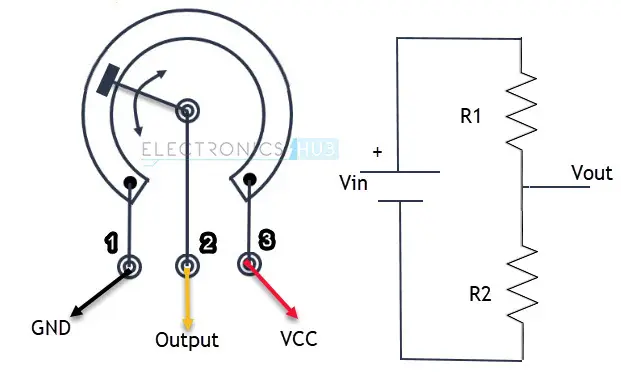

# Digitální a analogový vstup Arduina

### Cíle lekce
- Použít komunikaci přes sériový port funkcí ```Serial.println()``` k ověření funkce programu
- Zopakovat si základy jazyka C - práce s proměnnou, podmínka a cyklus
- Umět využívat funkci ```analogRead()``` pro měření napětí
- Umět zapojit potenciometr a číst z programu jeho polohu


<script type="text/javascript" id="MathJax-script" async 
  src="https://cdn.jsdelivr.net/npm/mathjax@3/es5/tex-svg.js"> 
</script> 

## Opakování z první lekce - digitální výstup
Program z předchozího bodu si uložte a vytvořte nový sketch (program). Vytvořte semafor pomocí Arduina a 3 LED (zelená, žlutá, červená). Vyberte si tři piny Arduina, připojte na každý pin jednu LEDku. Pak naprogramujte pomocí funkcí ```digitalWrite()``` a ```delay()``` aby se stav LEDek měnil podle fází semaforu viz obrázek níže.


**Bonus:** Přidejte k semaforu tlačítko pro chodce (pro auta svítí stále zelená, po stiknutí tlačítka se provede jeden cyklus semaforu, aby stihli chodci přejít a pak opět bude stále svítit zelená, až do dalšího stisknutí).


## Tlačítko
Tlačítko může sloužit jako jednoduché vstupní zařízení pro Arduino. Mechanicky je to vlastně jen pružný kontakt, který při stisku propojí dva kontakty. Způsobů, jak zapojit tlačítko je více, ukážeme si ten nejjednodušší, který nevyžaduje další součástky.

Jeden pól tlačítka zapojíme na digitální vstup Arduina (např. D2). Druhý pól tlačítka zapojíme na GND. V programu nastavíme vstup takto:

```c
pinMode(2, INPUT_PULLUP);
```

Arduino má uvnitř tzv. pull-up rezistor (cca 20–50 kΩ), který je zapojen mezi pin a napájecí napětí (+5V). Pokud je pullup rezistor aktivován, zajistí, že pin je za normálních okolností (nestisknut tlačítko) v úrovni HIGH. Když je tlačítko stisknuto, spojí se pin s GND a vstup se změní na LOW.

Nezapomeňte při psaní programu, že logika je obrácená:
- Stisknuté tlačítko = LOW
- Nestisknuté tlačítko = HIGH


## Úkoly
**1.** Program z předchozího bodu si uložte a vytvořte nový sketch (program). Připojte na jeden pin Arduina tlačítko a na jiný pin LEDku (nezapomeňte na rezistor). Pomocí funkce ```digitalRead()``` čtěte stav tlačítka. Pokud je stisknuté, rozsviťte LEDku. Pokud není stisknuté, LEDku zhasněte. Pin s tlačítkem  nastavte funkcí ```pinMode``` jako ```INPUT_PULLUP```.

## Analogový vstup
Digitální signál je nespojitý, má jen určité hodnoty (např. 0 a 1). Naproti tomu analogový signál je spojitý – může nabývat jakékoli hodnoty v čase. Příklad: zvukový signál v mikrofonu nebo napětí z teplotního čidla. 


Pro měření digitálního stavu pinu můžeme použít kterýkoli IO pin Arduina. Ovšem pro měření analogového signálu můžeme použít pouze piny označené písmenem A0-A7. Ty totiž lze připojit k AD převodníku na čipu mikroprocesoru (viz. [lekce ADC v MIT](https://tomaschovanec.github.io/MIT/13_ADC.html))

## Funkce analogRead()

Pro měření napětí použijeme funkci `analogRead()`. Jako argument funkci zadáme číslo pinu, na kterém chceme měřit. 
Tedy např. ```int napeti = analogRead(A4);```

Arduino má **10bitový A/D převodník**, což znamená, že dokáže rozlišit **$$2^{10} = 1024$$** úrovní napětí.

- Hodnota **0** odpovídá **0 V**.  
- Hodnota **1023** odpovídá **5 V**.  
- Jeden „dílek“ tedy představuje:  

$$  
\Large \frac{5V}{1024} = 4,88 \text{ mV}  
$$  

Například pokud `analogRead()` vrátí hodnotu **724**, vypočítáme napětí takto:  

$$  
\Large724 \times 4,88 \text{ mV} = 3,53 \text{ V}  
$$  

Napětí na vstupu je tedy přibližně 3,53 V.

## Potenciometr
Potenciometr je nastavitelný rezistor, který umožňuje plynule měnit odpor v obvodu. Má tři vývody – dva krajní pro pevný odpor a střední (jezdec), kterým nastavujeme hodnotu odporu mezi jedním krajem a jezdcem. Tím, že měníme odpor, měníme i napětí v obvodu (dělič napětí).



*Zdroj obrázku: https://www.electronicshub.org/how-potentiometer-works/*

## Úkoly
1. Zapojte k Arduinu potenciometr, čtete hodnotu funkcí analogRead do proměnné a posílejte na sériovou linku
2. Hodnotu převeďte na napětí ve voltech a pošlete na sériovou linku
3. Pokud je vyšší než 2,5V, rozsviťte LEDku
4. Potenciometrem měňte frekvenci blikání LEDky

### [Zpět na obsah](../README.md)
