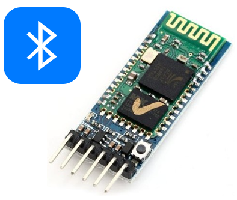
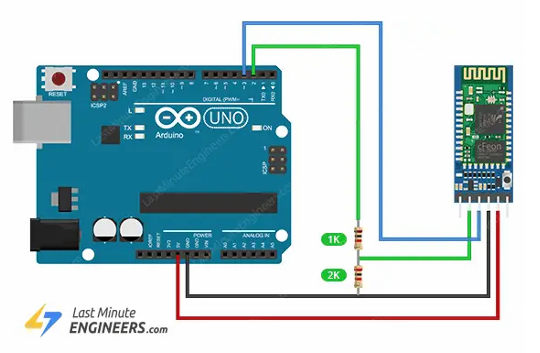
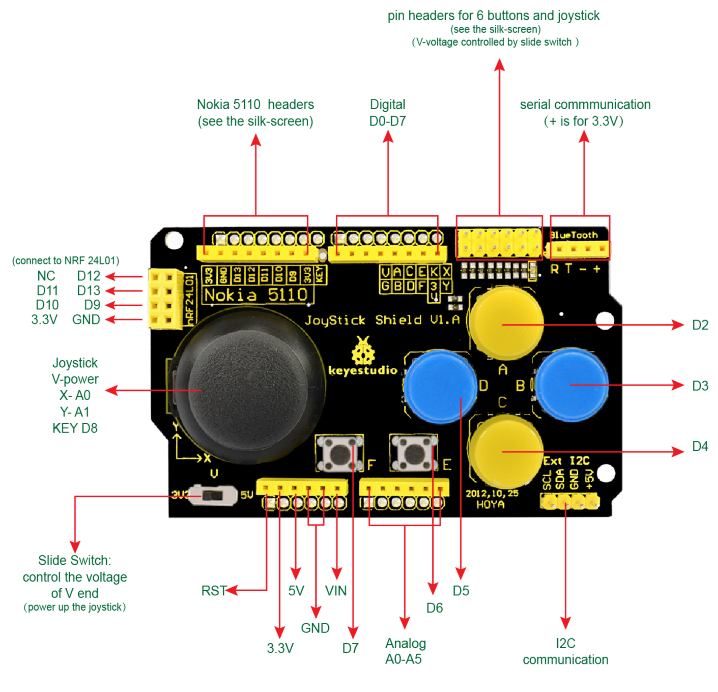
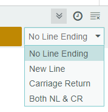

# Bluetooth


V dnešní lekci si ukážeme jak použít s Arduinem bezdrátovou komunikaci. Asi nejsnazší cestou je technologie Bluetooth. Je to 2,4GHz rádiový přenos určený na krátké vzdálenosti, který běžně používáme k připojení bezdrátových periferií jako sluchátek, reproduktorů, myší, klávesnic a mnoha dalšího. Dále můžeme s jeho pomocí například sbírat data ze senzorů nebo ovládat různá zařízení přes aplikaci na telefonu.

## Modul HC-05



V této lekci budeme používat bluetooth modul HC-05, který je velmi rozšířený, pro svou nízkou cenu a jednoduchou obsluhu. Nevýhoda je, že podporuje pouze starší standard Bluetooth 2.0, a proto není například kompatibilní s výrobky firmy Apple. Ovšem lze ho použít ke komunikaci s telefony Android, s notebooky či navázat komunikaci mezi dvěma moduly HC-05.

## Použití
HC-05 funguje jako bezdrátový UART bridge. Tedy pokud ho připojíme k pinům Rx a Tx Arduina, všechna data, která prostřednictvím sériové linky pošleme, se přenesou bezdrátově do spárovaného zařízení (mobil/počítač/jiný HC-05). Z pohledu psaní kódu tak nepotřebujeme žádnou speciální knihovnu, vystačíme si stejnými funkcemi standartní knihovny Serial, které jsme dosud používali ke komunikaci přes USB.

**Pozor:** Modul HC-05 lze napájet 5V, ale jeho vnitřní logika je 3,3V, tedy na jeho Rx pin nesmíme přivést vyšší napětí. To je problém, protože Arduino, které používáme má 5V napájení a pokud bychom napřímo propojili Tx Arduina a Rx HC-05, mohli bychom bluetooth modul zničit. Jak na školním robotovi tak na Joystick shieldu je to vyřešeno tak, že je Tx pin Arduina připojen přes dělič napětí, který 5V Arduina sníží na 3,3V pro HC-05. Pokud však budete dělat vlastní zapojení, nezapomeňte toto ošetřit.



Modul HC-05 může pracovat ve dvou režimech:

**1. AT mode** - v tomto módu můžeme modul pomocí takzvaných [AT příkazů](https://s3-sa-east-1.amazonaws.com/robocore-lojavirtual/709/HC-05_ATCommandSet.pdf) nakonfigurovat - změnit jeho jméno, nastavit PIN, nastavit, zda se má chovat jako master nebo slave atd. V naší lekci máme už předem nakonfigurované dvojice modulů, aby jeden byl master, druhý slave a master má v sobě uloženu adresu slave modulu, takže by párování mělo proběhnout automaticky. Pokud si ale chcete nastavení změnit, do AT režimu se dostanete tak, že modul odpojíte od napájení, držíte stisknuté tlačítko na modulu a napájení opět připojíte. Modul  by měl signalizovat AT režim pomalým blikáním LEDky.
   
**2. Data mode** - režim, kdy po úspěšném spárování přeposílá všechna data ze sériové linky z Arduina přes Bluetooth do druhého zařízení a naopak všechna data, která přijdou přes Bluetooth přenáší pomocí sériové linky do Arduina. Po připojení napájení začne modul rychle blikat, což znamená, že je v režimu párování. Po úspěšném spárování oba spárované moduly jednou za několik vteřin současně bliknou LEDkou.

**Pozor:** Protože mikrokontroler ATmega328, který je použit jak v Arduino Nano ve školním robotu, tak v Arduino UNO v pracovní sadě, má pouze jeden sériový port (jedna UART periferie). Ten se používá jak pro nahrávání programu, tak pro komunikaci s Bluetooth modulem. Aby se tyto dvě funkce navzájem nerušily, je potřeba vždy před nahráním programu Bluetooth modul vypnout nebo odpojit, jinak se program nepovede nahrát. Na robotovi stačí vypnout napájení modulu červeným vypínačem, na Joystick shieldu je třeba BT modul odpojit. 


## Joystick shield
Pro pohodlné ovládání robota použijeme Joystick shield - přídavnou desku, která se nasadí na Arduino a obsahuje směrová tlačítka, joystick a řadu praktických konektorů, mimo jiné i na bluetooth modul.



*Zdroj obrázku: https://wiki.keyestudio.com/Ks0153_keyestudio_JoyStick_Shield*


*Připojení Bluetooth modulu do školního robota a Joystick shieldu*

## Úkoly
Cílem této lekce je ovládat pohyb školního robota bezdrátově pomocí Bluetooth.

Pozor, narozdíl od jiných lekcí, dnes budeme psát dva programy - jeden po Arduino s ovladačem a druhý pro Arduino na robotovi. Oba programy budou samozřejmě odlišné, protože Arduino v ovladači nepotřebuje příkazy pro spouštení motorů a naopak Arduino v robotovi nepotřebuje vědět, na kterých pinech jsou připojeny tlačítka ovladače. 

Jediné, co musí mít oba programy stejné jsou příkazy. Tj, pokud ovladač zjistí, že uživatel stisknul tlačítko vpřed, odešle přes sériovou linku např zprávu 'F'. A naopak, Arduino v robotovi bude stále dokola kontrolovat, zda mu nepřišlka nějaká zpráva. Pokud mu při+jde 'F',, nastaví oba motory pro jízdu dopředu.

**Program pro robota** Naprogramujte robota tak, aby reagoval na jednoznakové povely přes sériovou linku (např. 'F' dopředu, 'B' dozadu atd.)  Použijte funkce [Serial.available()](https://docs.arduino.cc/language-reference/en/functions/communication/serial/available/) a [Serial.read()](https://docs.arduino.cc/language-reference/en/functions/communication/serial/read/). Funkčnost programu můžete ověřit tak, že budete povely posílat přes Serial monitor. Zvolte možnost *No line ending*, aby se neposílaly i znaky ```\n``` a ```\r```.



Pozor, v jazyce C se jednotlivé znaky píší v jednoduchách uvozovokách (např. ```char znak = 'a';```), zatímco textové řetězce v dvojitých (např. ```String slovo = "Ahoj";```).

**Program pro dálkový ovladač** Naprogramujte Arduino s Joystick shieldem, aby při stisku tlačítek A/B/C/D vysílalo po sériové lince jednoznakové povely (stejné, jako má nakonfigurován robot). Pro vysílání použijte funkci [Serial.write()](https://docs.arduino.cc/language-reference/en/functions/communication/serial/write/). Mezi jednotlivými znaky vložte čekání 100ms. Funkčnost programu můžete ověřit na PC s použitím sériového monitoru.

**Ovládání robota** Až budete mít hotový program pro robota i pro ovladač, připojte jak k robotovi tak k Arduinu s Joystick shieldem moduly HC-05 (nakonfigurované jako master a slave) a ověřte, že komunikace funguje a že lze robota dálkově ovládat.

### [Zpět na obsah](../README.md)
