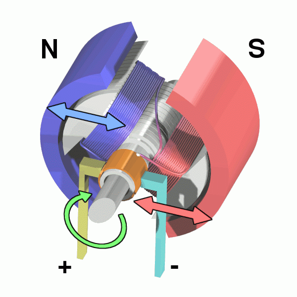
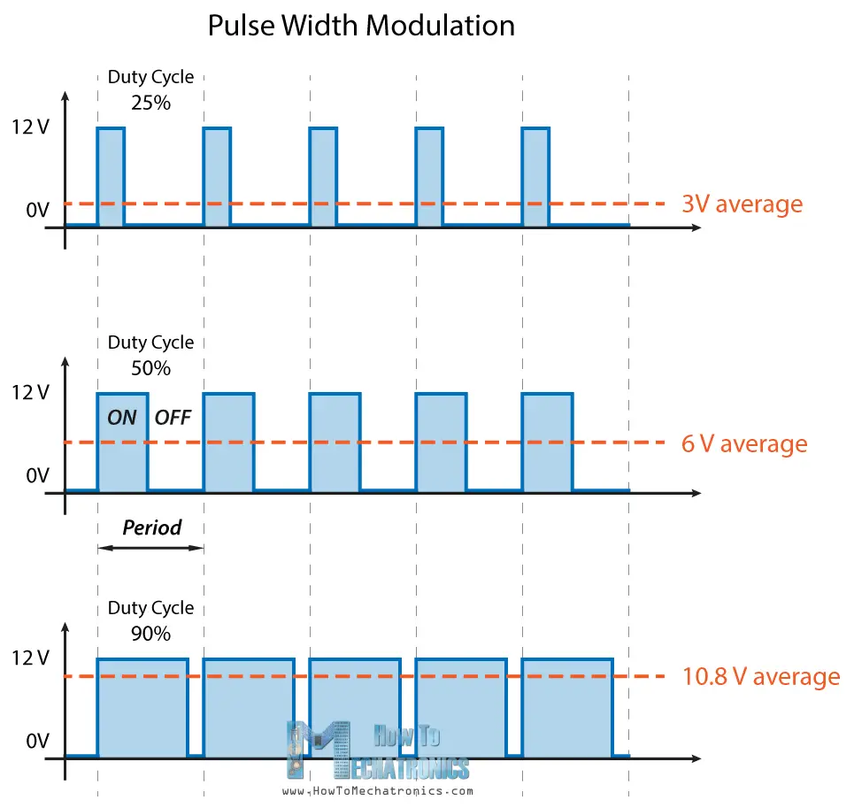
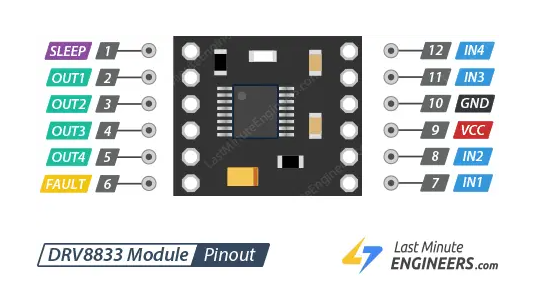
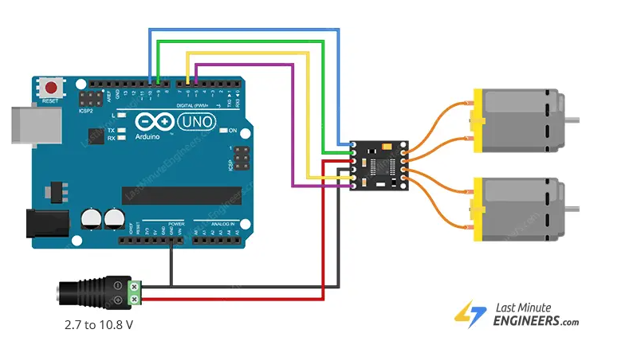

## Stejnosměrný motor
DC motor (stejnosměrný motor) je zařízení, které převádí elektrickou energii na mechanickou – konkrétně na otáčivý pohyb. Komutátor při otáčení motoru přepíná směr proudu, takže se motor točí stále stejným směrem.

**Stator** – pevná část, vytváří stálé magnetické pole (např. pomocí permanentních magnetů).

**Rotor (kotva)** – točivá část, obsahuje vinutí (cívky), do kterých se přivádí proud přes komutátor.

**Komutátor** – mechanický přepínač, který přepíná směr proudu ve vinutí během otáčení (bez něj by se motor jen jednou natočil a zůstal stát).

**Kartáče (uhlíky)** – pružné kontakty které přivádějí proud do komutátoru. Dochází k jejich opotřebení.

Video [o konstrukci stejnosměrného motoru](https://youtu.be/LAtPHANEfQo?feature=shared)



*Zdroj obrázku: https://dronebotworkshop.com/dc-motors-l298n-h-bridge/*

## H-můstek
H-můstek (anglicky H-bridge) je elektronický obvod, který slouží k řízení směru otáčení DC motoru. Umožňuje motor otáčet na jednu stranu,na druhou stranu nebo zastavit (volitelně i regulovat rychlost pomocí PWM).
Obsahuje 4 spínače (např. tranzistory) uspořádané do tvaru písmene H. Přepínáním těchto spínačů lze změnit směr proudu procházejícího motorem a tím směr otáčení.


Pro řízení rychlosti DC motoru můžeme použít PWM pomocí funkce analogWrite().



*Zdroj obrázku: https://howtomechatronics.com/tutorials/arduino/arduino-dc-motor-control-tutorial-l298n-pwm-h-bridge/*


## Výukový robot


Robot, kterého budeme ve výuce použivat, v sobě obsahuje Arduino Nano (má stejný procesor jako Arduino UNO, které obvykle používáme, ale má menší desku). Aby mohl jezdit, má dva stejnosměrné motory s převodovkou, které jsou řízeny pomocí H můstku DRV8833. Schéma pro výukového robota ke stažení [zde](https://github.com/TomasChovanec/Arduino_robotek/raw/main/FrenGP_robot/Robot_schematics.pdf)

## Pinout modulu DRV8833 a princip použití
Obvod [DRV8833](https://lastminuteengineers.com/drv8833-arduino-tutorial/) v sobě obsahuje dva H můstky, můžeme s ním tedy řídít dva stejnosměrné motory. Vstupy IN1-4 připojíme k pinům Arduina, které podporují PWM výstup, abychom mohli řídit plynule rychlost motorů.





*Zdroj obrázků: https://lastminuteengineers.com/drv8833-arduino-tutorial/*

## Režimy ovládání motoru
Zda a jakým směrem se motory budou točit nastavíme kombinací vstupů IN1 a IN2 pro první motor a IN3 A IN4 pro druhý motor:

| IN1     | IN2     | Spinning Direction |
|----------|----------|--------------------|
| Low (0)  | Low (0)  | Motor OFF          |
| Low (0)  | High (1) | Forward            |
| High (1) | Low (0)  | Reverse            |
| High (1) | High (1) | Motor OFF          |

## Úkoly
1. Prostudujte si schéma robota. Zkuste roztočit postupně oba motory oběma směry.
1. Vytvořte funkce ```vpred(int rychlost)```, ```vzad(int rychlost)```, ```vlevo(int rychlost)```, ```vpravo(int rychlost)``` a ```stop()```
1. Napište program, kde robot pojede 3s rychle dopředu, pak se zastaví, otočí o 180° a pojede pomalu zpět.
1. Pokud jede šikmo, upravte mírně rychlost jednoho z motorů, aby robot jel rovně.
1. Přidejte bezpečnostní funkci - robot se nerozjede hned po nahrání programu, ale až po stisknutí tlačítka na robotovi.
1. Použijte ultrazvukový senzor pro detekci překážky - pokud je detekována překážka do 20 cm, zastavte robota.
1. Stejně jako v předchozím bodě, ale přidejte při detekci překážky krátce zacouvejte a pokračujte jiným směrem.


### [Zpět na obsah](../README.md)
