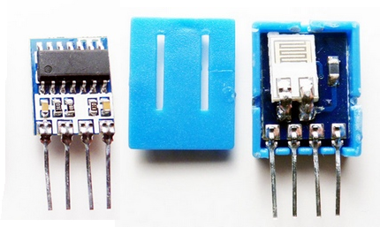
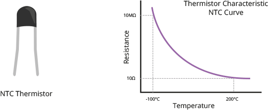

# Teplotní a vlhkostní čidlo DHT11

### Cíle lekce
- Chápat princip čidla DHT11
- Umět nainstalovat novou knihovnu do Arduina pomocí Library manageru

DHT11 je jednoduché digitální čidlo, které měří teplotu a vlhkost. Připojuje se k Arduinu 3 piny: VCC, GND, DATA. Má plastové pouzdro s otvory pro proudění vzduchu a uvnitř obsahuje:

- **Teplotní senzor** — umožňuje měřit teplotu v rozsahu 0–50 °C s přesností ±2 °C.
- **Senzor vlhkosti** — umožňuje měřit relativní vlhkost v rozsahu 20–90 % s přesností ±5 %.
- **Integrovaný obvod** — měří vlhkost a teplotu pomocí dvou výše zmíněných čidel a data posílá digitálně po jediném datovém pinu.







*Zdroj obrázků: https://howtomechatronics.com/tutorials/arduino/dht11-dht22-sensors-temperature-and-humidity-tutorial-using-arduino/ *


## Přidání knihovny do Arduina

Knihovny v Arduinu jsou předpřipravené balíčky kódu, které usnadňují práci s různými senzory, moduly nebo složitějšími funkcemi. Díky tomu nemusíme psát všechno od nuly, knihovna se postará o složitější části programu, např. komunikaci se senzorem. 

Knihovny také zpravidla obsahují příklady použití (**Examples**). Najdeme je přes menu **File -> Examples -> Název knihovny** . Z  příkladů můžeme snadno pochopit, jak pracovat s danou knihovnou.

### Přidání knihovny pomocí Library manageru

- V horním menu vyberte Tools > Manage Libraries…
- Do vyhledávacího pole napite název knihovny (nebo část názvu). Seznam knihoven se bude filtrovat podle toho, co píšte.
- Výsledky jsou seřazené abecedně, takže možná budete muset posunout dolů, než ji najdete.
- Nainstalujte knihovnu: Klikněte na zvolenou knihovnu. Můžete si přečíst popis a jméno autora. Pak klikněte na "Install". Arduino IDE automaticky vybere nejnovější verzi knihovny.

### Úkoly:
1. Pomocí Library manageru si nainstalujte knihovnu DHTlib (autor Rob Tillaart).
2. Připojte k Arduinu sensor DHT11 a zobrazujte naměřená data v Serial monitoru. Použijte příklad níže, nezapomeňte správně nastavit číslo pinu, kam jste čidlo připojili.

```c
#include <dht.h>        // Include library

dht sensor;             // Creates a DHT object
int outPin = 2;        // Defines pin number to which the sensor is connected

void setup() {
	Serial.begin(9600);
}

void loop() {
	int readData = sensor.read11(outPin);	// Starts the conversion

	float temp = sensor.temperature;        // Read temperature
	float humid = sensor.humidity;           // Read humidity

	Serial.print("Temperature = ");
	Serial.print(temp);
	Serial.print("°C ");
	Serial.print("Humidity = ");
	Serial.print(humid);
	Serial.println("% ");
	Serial.println("");

	delay(2000); // wait two seconds
}
```


1. Připojte ještě LCD displej a zobrazujte na jednom řádku teplotu, na druhém vlhkost.
1. Použijte pro zobrazení teploty znak °C. Vysvětlení, jak zobrazovat speciální znaky najdete například [zde](https://arduino.stackexchange.com/questions/46828/how-to-show-the-%C2%BA-character-in-a-lcd).
1. Na displeji zobrazujte aktuální teplotu a pak také minimální a maximální teplotu od startu programu.
1. Vytvořte program, který sleduje teplotu z DHT11 a porovnává ji s limitem. Limit se bude nastavovat potenciometrem. Pokud teplota překročí tento limit, na LCD se zobrazí varování. Na LCD zobrazujte aktuální teplotu i nastavený limit.

## [Zpět na obsah](README.md)
