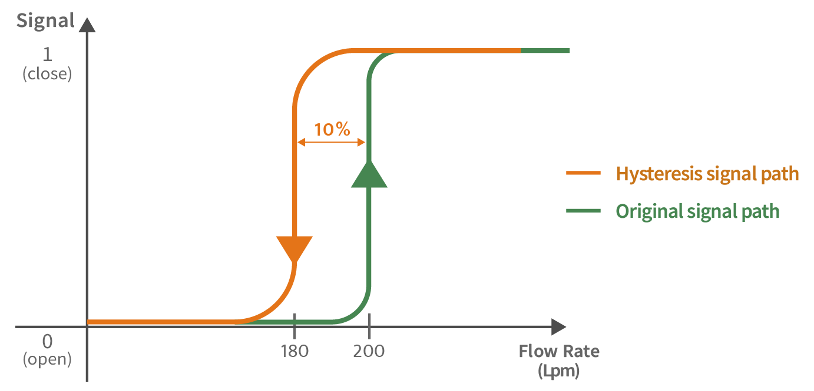

## Fotorezistor

Fotorezistor je polovodičová součástka, která mění svůj odpor v závislosti na osvětlení - čím více fotonů na něj dopadá, tím více se v něm tvoří volných elektronů a roste jeho vodivost. Fotorezistor, který budeme používat na cvičení má odpor od 100Ohmů při maximální osvětlení, přes  10-20kΩ při slabém osvětlení až po 1MΩ v temnu.

Pokud jej zapojíme spolu s pevným rezistorem jako dělič napětí, můžeme pak AD převodníkem měřit spojitě intenzitu světla.

### Zadání:

**1.** Zapojte k Arduinu napěťový dělič s fotorezistorem a na serial monitoru zobrazujte intenzitu osvětlení

**2.** Pomocí LEDky na Arduino desce indikujte, zda je v místnosti světlo nebo tma. Hraniční hodnotu si určete dle svého uvážení.

**3.** Připojte k Arduinu servo a simulujte zavírání žaluzií na základě slunečního svitu 
- při dostatečném osvětlení (nad nastavenou hranicí) se žaluzie zavřou (servo se přesune na 90°).
- při slabém osvětlení (pod hranicí) se žaluzie otevřou (0°).
      
**4.** Zajistěte, aby se žaluzie neustále nehýbaly při kolísání intenzity světla kolem hraniční hodnoty. Implementujte **hysterezi** – nastavte různé prahy pro zavření a otevření žaluzií, aby servo nereagovalo na malé změny světla.

*Zdroj obrázku: https://www.lorric.com/en/Articles/flowmeter-technology/flowmeter-technology/hysteresis-function*

**5.** Zabraňte tomu, aby žaluzie reagovaly okamžitě na každé krátké zastínění senzoru (např. když kolem projde člověk). Stav žaluzií se změní pouze tehdy, pokud světlo nebo tma trvá déle než 5 sekund.

### [Zpět na obsah](../README.md)
