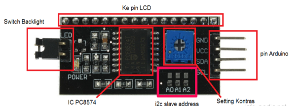
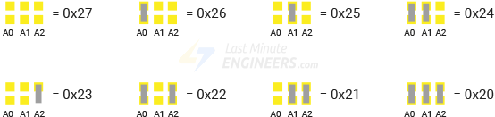
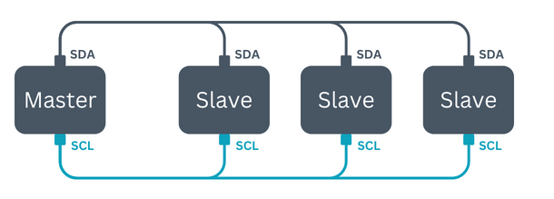
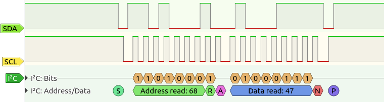

# LCD displej

### Cíle lekce
- Umět nainstalovat novou knihovnu do Arduina ze .zip souboru
- Chápat princip sběrnice I2C
- Umět použít LCD displej pro zobrazení dat z Arduina


### Přidání knihovny ze zip souboru
[Knihovna ke stažení zde](https://github.com/fdebrabander/Arduino-LiquidCrystal-I2C-library/archive/refs/heads/master.zip)
- V horním menu vyberte: Sketch > Include Library > Add .ZIP Library…
- V dialogovém okně najděte soubor s knihovnou s příponou .zip a klikni na Open.
- Knihovna se automaticky rozbalí a přidá mezi ostatní knihovny. Najdete ji pak v Sketch  → Include library.






*Zdroj obrázku:  https://lastminuteengineers.com/i2c-lcd-arduino-tutorial/*

## I2C sběrnice
I2C (Inter-Integrated Circuit) je sériová sběrnice, která umožňuje komunikaci mezi více zařízeními (senzory, displeje, moduly) pomocí pouze dvou vodičů:
- SDA (Data) – přenáší data mezi zařízeními.
- SCL (Clock) – řídí časování přenosu dat.

Výhody I2C s Arduinem
- Úspora pinů – stačí jen 2 dráty pro připojení více zařízení (každé má unikátní adresu).
- Jednoduché zapojení – méně kabelů, méně zmatků.
- Podpora knihoven – Arduino má knihovny jako Wire.h pro snadné ovládání.
- Možnost rozšíření – připojení až 128 zařízení na stejnou sběrnici (adresy 7bit).
- Obousměrná komunikace – Master (Arduino) může posílat i přijímat data.
 

 
*Zdroj obrázku: https://www.hibit.dev/posts/102/communication-protocols-uart-i2c-and-spi*


 
### Použití knihovny [LiquidCrystal_I2C](https://github.com/fdebrabander/Arduino-LiquidCrystal-I2C-library)

```#include <LiquidCrystal_I2C.h>``` Načte knihovnu pro ovládání LCD displeje s I2C adaptérem.

```LiquidCrystal_I2C lcd(0x27, 16, 2);``` Vytvoří objekt lcd s adresou 0x27. 16, 2 znamená, že displej má 16 sloupců a 2 řádky. Tento kód umístěte nad funkci setup, aby byl objekt displeje globální a mohli jste ho používat jak ve funkci setup() tak ve funkci loop().

```lcd.begin();``` Inicializuje displej — připraví ho na použití.

```lcd.clear();```  Vyčistí obsah displeje.

```lcd.setCursor(0,1);``` Nastaví kurzor na 1. sloupec (indexuje se od 0) a 2. řádek.

```lcd.print("Hello world!");```  Vypíše text "Hello world!" od zadané pozice kurzoru.


### Úkoly:
1. Připojte k Arduinu LCD displej a zobrazte na první řádek své jméno, na druhý příjmení
1. Zobrazte na displeji odpočet od 10 do 0 po 0,5s. Po skončení odpočtu zobrazte libovolný vzkaz.
1. Připojte potenciometr a na displeji zobrazujte polohu potencimetru v procentech.  

### [Zpět na obsah](../README.md)
