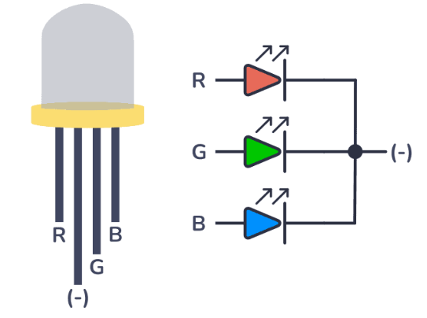

# PWM s Arduinem - funkce analogWrite()

### Cíle lekce
- Pochopit jak funguje pulzně šířková modulace (PWM) a k čemu ji lze použít
- Umět použít na Arduinu PWM pomocí funkce analogWrite()
- Umět řídit pomocí PWM jednotlivé barvy RGB LEDky

## PWM
PWM (Pulse Width Modulation) je metoda, která mění průměrnou hodnotu napětí rychlým zapínáním a vypínáním signálu. 

Čím déle je signál v logické 1 (zapnutý), tím vyšší je výsledné napětí.

Čím kratší je zapnutý stav, tím nižší je výsledné napětí.

Zkuste měnit nastavení duty cycle a frekvenci PWM [na této stránce](https://pico.implrust.com/core-concepts/pwm/index.html#duty-cycle)

V Arduinu můžeme PWM snadno nastavovat pomocí funkce analogWrite():

```analogWrite(pin, hodnota);```

```hodnota``` je od 0 (0%) do 255 (100%)
```pin```je označení pinu, na kterých PWM nastavujeme 

:warning:**Pozor, funkce analogWrite je dostupná pouze pro některé piny. Ty jsou označené na desce znakem vlnovky. U Arduino UNO jsou to piny 3, 5, 6, 9, 10, a 11.**


*Zdroj obrázku: https://howtomechatronics.com/tutorials/arduino/how-to-use-a-rgb-led-with-arduino/*

## RGB LED
RGB LED jsou vlastně 3 LEDky v jednom pouzdře – červená (R), zelená (G) a modrá (B).

Každou barvu můžeme ovládat zvlášť. Pokud k tomu použijeme PWM, můžeme kombinací intenzit jednotlivých barevných složek namíchat různé barvy.



*Zdroj obrázku: https://www.build-electronic-circuits.com/rgb-led/*

### Úkoly:
1. Připojte k Arduinu RGB LEDku. Vyberte si jednu barvu a napište program tak, aby se každou sekundu měnily postupně tři stavy: LEDka je zhasnutá -> LEDka svítí na 50% -> LEDka svítí na 100%.
2. Změňte program z předchozího bodu tak, aby se jas LEDky měnil plynule od minima do maxima a zpět.
3. Připojte k Arduinu ještě potenciometr. Podle polohy potenciometru nastavujte jas LEDky funkcí analogWrite().
4. Nastavte na RGB LEDce růžovou barvu.
5. Pomocí cyklu for měňte plynule barvu LEDky z modré na zelenou a zpět.
6. Pomocí tří potenciometrů nastavujte všechny tři barevné složky RGB LEDKy.

## [Zpět na obsah](README.md)
