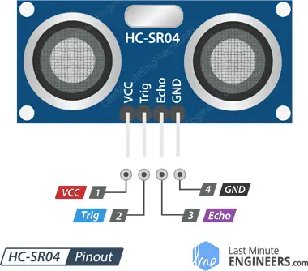

# Ultrazvukový sensor HC-SR04

### Cíle lekce
- Pochopit princip ultrazvukového měření vzdálenosti
- Vytvořit funkční zapojení a program pro měření vzdálenosti se senzorem HC-SR04

Hlavní parametry senzoru:

| Parametr         | Hodnota          |
|------------------|------------------|
| Napájecí napětí  | 5V               |
| Proudový odběr   | ~15 mA           |
| Frekvence ultrazvuku | 40 kHz       |
| Měřicí rozsah    | 2 – 400 cm       |
| Přesnost         | ±3 mm            |
| Úhel detekce     | ~15°             |
| Rozhraní         | 2 digitální piny (Trig, Echo) |

## Princip senzoru


*Zdroj obrázku: https://howtomechatronics.com/tutorials/arduino/ultrasonic-sensor-hc-sr04/*

### Zapojení
Kromě obligátního +5V napájení a GND musíme čidlo připojit ke dvěma libovolným digitálním pinům Arduina. **Pin Trig** slouží ke spuštění měření (vyslání ultrazvukového pulzu), musíme jej tedy v Arduinu nastavit jako výstup. **Pin Echo** je výstup senzoru (tedy z pohledu Arduina vstup), na kterém senzor generuje puls, jehož délka odpovídá době od vyslání signálu do návratu odražené vlny.



### Průběh signálu na pinech Trig a Echo:


### Ukázka echo signálu na osciloskopu


### Funkce pulseIn()
Abychom zjistili změřenou vzdálenost, potřebujeme změřit délku pulzu na pinu Echo. Mohli bychom pro to použít periferii mikrokontroleru časovač, ale usnadníme si práci využitím standartní funkce Arduino pulseIn(). Funkce vyžaduje dva argumenty -  na jakém pinu chceme pulz měřit a zda chceme měřit délku HIGH nebo LOW pulzu.

```c
int pin = 7;
unsigned long duration;

void setup() {
  Serial.begin(9600);
  pinMode(pin, INPUT);
}

void loop() {
  duration = pulseIn(pin, HIGH);
  Serial.println(duration);
}
```

### Úkoly
1. Připojte k Arduinu ultrazvukový senzor. Měřte vzdálenost a změřenou hodnotu posílejte na serial monitor.
2. Přidejte navíc LCD displej a naměřenou hodnotu na něm zobrazujte v centimetrech. Připojte Arduino na powerbanku a zkuste změřit i větší vzdálenosti v místnosti. Ověřte limity senzoru.

### [Zpět na obsah](../README.md)
