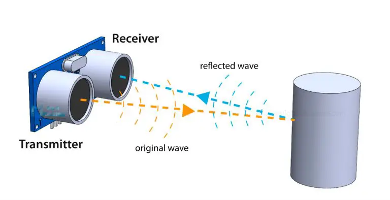

# Ultrazvukový sensor HC-SR04

### Cíle lekce
- Pochopit princip ultrazvukového měření vzdálenosti
- Vytvořit funkční zapojení a program pro měření vzdálenosti se senzorem HC-SR04

Hlavní parametry senzoru:

| Parametr         | Hodnota          |
|------------------|------------------|
| Napájecí napětí  | 5V               |
| Proudový odběr   | ~15 mA           |
| Frekvence ultrazvuku | 40 kHz       |
| Měřicí rozsah    | 2 – 400 cm       |
| Přesnost         | ±3 mm            |
| Úhel detekce     | ~15°             |
| Rozhraní         | 2 digitální piny (Trig, Echo) |


## Princip senzoru
HC-SR04 měří vzdálenost pomocí ultrazvuku. Po impulsu na pinu TRIG vyšle krátký ultrazvukový signál (40 kHz) a čeká na jeho odraz od překážky. Od doby odeslání signálu až do chvíle, kdy se odražený signál vrátí, pin je pin ECHO v log. 1. V okamžiku kdy je detekován odraz, nastaví se do log. 0. Z délky tohoto impulzu se podle rychlosti zvuku spočítá vzdálenost.



*Zdroj obrázku: https://howtomechatronics.com/tutorials/arduino/ultrasonic-sensor-hc-sr04/*


### Komunikace čidla s Arduinem
Kromě +5V napájení a GND musíme čidlo připojit ke dvěma libovolným digitálním pinům Arduina. **Pin Trig** slouží ke spuštění měření (vyslání ultrazvukového pulzu), musíme jej tedy v Arduinu nastavit jako výstup. **Pin Echo** je výstup senzoru (tedy z pohledu Arduina vstup), na kterém senzor generuje puls, jehož délka odpovídá době od vyslání signálu do návratu odražené vlny.

### Průběh signálu na pinech Trig a Echo:


*Zdroj obrázku: https://pico.implrust.com/ultrasonic/how-it-works.html*


### Ukázka echo signálu na osciloskopu


*Zdroj obrázku: https://electronoobs.com/eng_arduino_tut36.php*


### Funkce pulseIn()
Abychom zjistili změřenou vzdálenost, potřebujeme změřit délku pulzu na pinu Echo. Mohli bychom pro to použít periferii mikrokontroleru časovač, ale usnadníme si práci využitím standartní funkce Arduino pulseIn(). Funkce vyžaduje dva argumenty -  na jakém pinu chceme pulz měřit a zda chceme měřit délku HIGH nebo LOW pulzu.

```c
int pin = 7;
unsigned long duration;

void setup() {
  Serial.begin(9600);
  pinMode(pin, INPUT);
}

void loop() {
  duration = pulseIn(pin, HIGH);
  Serial.println(duration);
}
```

### Úkoly
1. Připojte k Arduinu ultrazvukový senzor. Měřte délku pulzu na pinu Echo pomocí funkce pulseIn() a tuto hodnotu posílejte na Serial monitor.
2. Upravte program tak, aby délku pulzu přepočítal na zdálenost v centimetrech a tu opět posílejte na Serial monitor.
3. Přidejte navíc LCD displej a naměřenou hodnotu na něm zobrazujte. Připojte Arduino na powerbanku a zkuste změřit i větší vzdálenosti v místnosti. Ověřte limity senzoru.

### [Zpět na obsah](../README.md)
