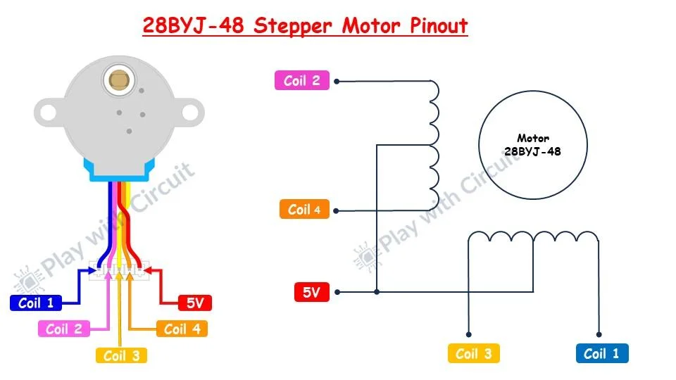
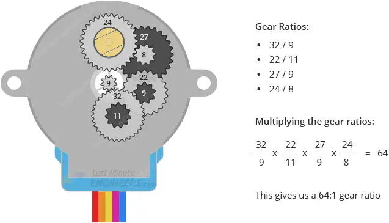
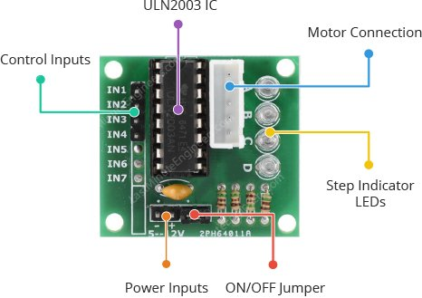

# Krokový motor
Dalším zařízení, které si zkusíme řídit Arduinem bude krokový motor. V našem případě malý unipolární krokový motor **28BYJ-48**.

### Schema zapojení, princip funkce
Motor 28BYJ-48 je unipolární krokový motor se čtyřmi cívkami uspořádanými do dvou sekcí. Každá sekce má střední odbočku připojenou na 5V. Když připojíme jeden z konců cívky k zemi, začne cívkou procházet proud, což vytvoří magnetické pole. Interakce tohoto pole s magnetickým polem permanentního magnetu v rotoru způsobí pootočení motoru o jeden krok. Postupným přepínáním napájení mezi jednotlivými cívkami dochází k rotaci motoru krok za krokem


*Zdroj obrázku: https://www.seeedstudio.com/blog/2019/03/04/driving-a-28byj-48-stepper-motor-with-a-uln2003-driver-board-and-arduino/*



*Zdroj obrázků: https://playwithcircuit.com/28byj48-stepper-motor-arduino-tutorial/*

### Převodovka
Pro dosažení vyššího momentu a jemnějšího řízení polohy je motor vybaven převodovkou s přibližným převodovým poměrem 1:64, tedy pro jedno plné otočení výstupní hřídele je potřeba přibližně 64 otáček motoru.

Podle datasheetu odpovídá u motoru 28BYJ-48 v režimu plného kroku každý krok otočení o 11,25°. To znamená, že na jednu otočku je 32 kroků (360°/11,25° = 32).

Uvnitř motoru je navíc převodovka s převodem 64:1. Výsledkem je 2048 kroků na jednu otáčku (32×64).



*Zdroj obrázků: https://lastminuteengineers.com/28byj48-stepper-motor-arduino-tutorial/*

### Konstrukce
Jak vypadá motor uvnitř můžete vidět [zde](https://cookierobotics.com/042/).

## Driver ULN2003 
Protože motorem teče příliš velký proud na to, abychom ho řídilo piny Arduina napřímo, použijeme driver pro krokový motor. Ten nám poslouží jako výkonový spínač.




*Zdroj obrázků: https://lastminuteengineers.com/28byj48-stepper-motor-arduino-tutorial/*


### Úkoly
1. Připojte ke krokovému motoru napájení a zkuste ručně postupným připojováním 5V na piny IN1-4 motor rozpohybovat.
2. Až zjistíte, jak motorem pohybovat ručně, připojte piny IN1-4 k Arduinu a ovládejte je pomocí fenkce ```digitalWrite()``` - točte motorem pomocí Arduina
3. Vytvořte si funkce ```stepForward(int numSteps)```a ```stepBackward(int numSteps)``` argument ```int numSteps``` bude udávat, o kolik kroků se má motor otočit.
4. Pomocí funkcí z předchozího úkolu točte motorem střídavě čtvrt otáčky po směru a půl otáčky proti směru hodinových ručiček.
5. Zjistěte si, jaký je rozdíl mezi polovičním a plným krokem (half step vs. full step) například [tady](https://www.rs-online.com/designspark/stepper-motors-and-drives-what-is-full-step-half-step-and-microstepping) a vytvořte funkce ```halfStepForward(int numSteps)```a ```fullStepForward(int numSteps)```
6. Vyberte takový způsob řízení, aby se motor točil co nejrychleji.

### [Zpět na obsah](README.md)
